> 在本教程中，我们将构建一个简单的 MCP 天气查询服务，并将其连接到 [Cherry Studio](https://cherry-studio.com) 中。其中天气服务由[和风天气](https://www.qweather.com/)提供，如本教程中的相关配置无法使用请自行去和风天气官网注册或使用其他天气服务。

## 准备工作

### （可选）注册天气服务 API （此处以和风天气为例）

> 🎁 教程代码中已经配置好了天气服务 API，如无法使用请自行注册或使用其他天气服务。

- 访问[https://id.qweather.com/](https://id.qweather.com/) 注册账号,初次使用需绑定手机号和邮箱。


- 注册成功后，点击菜单中的 `开发服务控制台`，进入开发控制台。
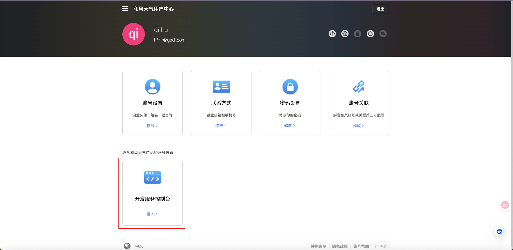

- 点击`项目管理`-`创建项目`，创建一个项目，如 `fastapi`， 创建之后此步骤获得**PROJECT_ID**。
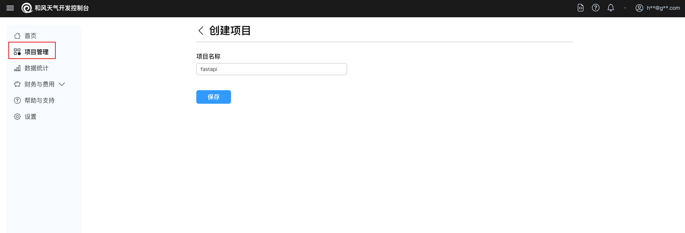
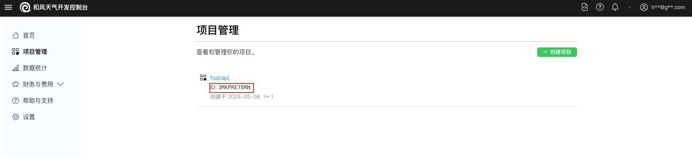

- 点击项目如`fastapi`，进入项目详情页并点击`创建凭据`开始创建 JWT 凭据，需先在本地生成公私钥对再创建，创建之后此步骤获得**PRIVATE_KEY**和**KEY_ID**。（PS: 虽然 APIKey 更简单，但推荐使用JSON Web Token (JWT)的认证方式获得更高等级的安全性以及不受限的API请求）
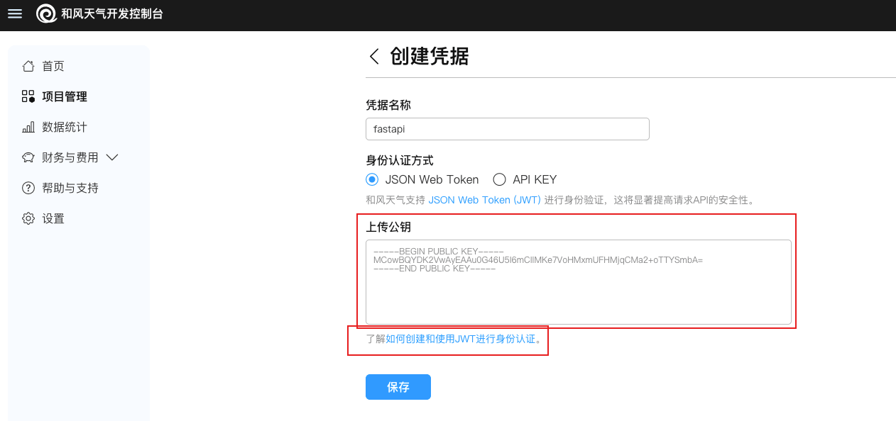
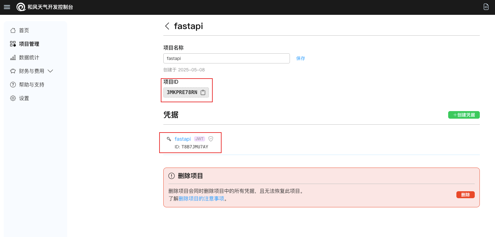

- 点击`设置`, 从开发者信息中获取 API Host，也就是**WEATHER_API_HOST**
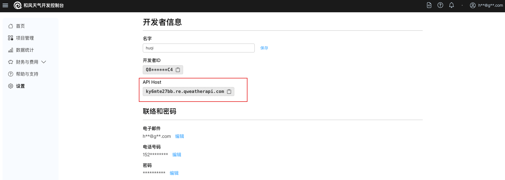

至此，我们天气查询 MCP 中需要用到的配置信息已经全部获取。

### （可选）安装 MCP 客户端 （此处以 Cherry Studio 为例）

> 🔧 选用你使用最多的 MCP 客户端即可，此处仅作参考

从 [Cherry Studio](https://cherry-studio.com) 安装 MCP 客户端，并配置好模型服务。
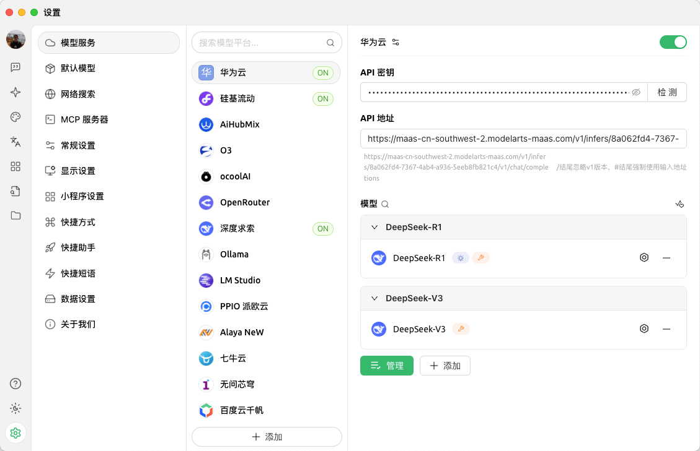

## 代码编写

我们创建 `main.py` 文件，并编写代码。

## 引入依赖

```python
from fastapi import FastAPI, HTTPException, Depends, Query, status
from fastapi.security import HTTPBearer
from pydantic import BaseModel, Field
from typing import List, Optional, Dict, Any
import jwt
import time
import requests
from datetime import datetime
import base64
from cryptography.hazmat.primitives import serialization
from cryptography.hazmat.backends import default_backend
# 引入 fastapi_mcp
from fastapi_mcp import FastApiMCP, AuthConfig
```

## 配置天气服务 API

```python
app = FastAPI(title="天气查询API")

# 配置项 - 在实际应用中应从环境变量或配置文件中读取
# PRIVATE_KEY = """YOUR_PRIVATE_KEY"""
# PROJECT_ID = "YOUR_PROJECT_ID"
# KEY_ID = "YOUR_KEY_ID"
# WEATHER_API_HOST = "your_api_host"
PRIVATE_KEY = "MC4CAQAwBQYDK2VwBCIEIG2wMZga50X1YDHmR8jkE5TGKNXpriFPXXCT/kgwZkcT"
PROJECT_ID = "3MKPRE78RN"
KEY_ID = "T8B7JMU7AY"
WEATHER_API_HOST = "ky6mte27bb.re.qweatherapi.com"
```

## 定义响应 Model

```python
# 响应模型
class Location(BaseModel):
    name: str
    id: str
    lat: str
    lon: str
    adm2: str
    adm1: str
    country: str
    tz: str
    utcOffset: str
    isDst: str
    type: str
    rank: str
    fxLink: str

class LocationResponse(BaseModel):
    code: str
    location: List[Location]

class WeatherNow(BaseModel):
    obsTime: str
    temp: str
    feelsLike: str
    icon: str
    text: str
    wind360: str
    windDir: str
    windScale: str
    windSpeed: str
    humidity: str
    precip: str
    pressure: str
    vis: str
    cloud: str
    dew: str

class ReferSources(BaseModel):
    sources: List[str]
    license: List[str]

class WeatherResponse(BaseModel):
    code: str
    updateTime: str
    fxLink: str
    now: WeatherNow
    refer: ReferSources

class JWTRequest(BaseModel):
    expiry_seconds: Optional[int] = 900  # 默认15分钟
    custom_claims: Optional[dict] = None  # 允许添加自定义声明

class WeatherQuery(BaseModel):
    city: str = Field(..., description="城市名，如：北京")
```

## JWT 令牌生成

```python
# 解码并加载私钥
try:
    _der_key_bytes = base64.b64decode(PRIVATE_KEY)
    PRIVATE_KEY = serialization.load_der_private_key(
        _der_key_bytes,
        password=None,
        backend=default_backend()
    )
except Exception as e:
    print(f"关键错误：无法从配置加载EdDSA私钥。错误: {e}")
    PRIVATE_KEY = None
    if PRIVATE_KEY is None:
        raise RuntimeError(f"关键错误：EdDSA私钥加载失败，应用无法启动。错误: {e}")

# 令牌缓存（简单实现，生产环境应使用Redis等缓存系统）
token_cache = {
    "token": None,
    "expires_at": 0
}

# Bearer Token 安全头
token_auth_scheme = HTTPBearer() 
EXPECTED_BEARER_TOKEN = "zishu.co" # 定义期望的固定Token
# Bearer Token 验证依赖
async def verify_bearer_token(token_payload = Depends(token_auth_scheme)):
    if token_payload.credentials != EXPECTED_BEARER_TOKEN:
        raise HTTPException(
            status_code=status.HTTP_401_UNAUTHORIZED,
            detail="无效的认证凭据",
            headers={"WWW-Authenticate": "Bearer"},
        )
    return token_payload.credentials

# 生成JWT令牌
def generate_jwt(expiry_seconds: int = 900):
    current_time = int(time.time())
    
    # 构建标准JWT载荷
    payload = {
        'iat': current_time - 30,  # 颁发时间（提前30秒，避免时钟偏差问题）
        'exp': current_time + expiry_seconds,  # 过期时间
        'sub': PROJECT_ID  # 主题（项目ID）
    }
    
    # JWT头部
    headers = {
        'kid': KEY_ID  # 密钥ID
    }
    
    if PRIVATE_KEY is None:
        raise ValueError("JWT生成失败: 私钥未初始化或加载失败。")

    try:
        # 生成JWT
        encoded_jwt = jwt.encode(payload, PRIVATE_KEY, algorithm='EdDSA', headers=headers)
        
        # 更新缓存
        token_cache["token"] = encoded_jwt
        token_cache["expires_at"] = current_time + expiry_seconds - 60  # 提前1分钟过期，确保安全
        
        return encoded_jwt
    except Exception as e:
        raise ValueError(f"JWT生成失败: {str(e)}")

# 获取有效的JWT令牌（如果缓存中有有效令牌则使用缓存，否则生成新令牌）
def get_valid_token():
    current_time = int(time.time())
    
    # 检查缓存中的令牌是否有效
    if token_cache["token"] and token_cache["expires_at"] > current_time:
        return token_cache["token"]
    
    # 生成新令牌
    return generate_jwt()

@app.post("/generate-jwt", operation_id="generate_jwt", tags=["JWT"])
async def create_jwt(
    request: JWTRequest = JWTRequest()
):
    """
    生成JWT令牌
    
    - 使用EdDSA算法签名
    - 默认有效期为15分钟
    - 可以添加自定义声明
    """
    try:
        encoded_jwt = generate_jwt(request.expiry_seconds)
        current_time = int(time.time())
        
        return {
            "jwt": encoded_jwt,
            "expires_at": datetime.fromtimestamp(current_time + request.expiry_seconds).isoformat(),
            "issued_at": datetime.fromtimestamp(current_time - 30).isoformat(),
            "valid_for_seconds": request.expiry_seconds
        }
    except Exception as e:
        raise HTTPException(status_code=500, detail=str(e))
```

## 天气查询接口

```python
# 发送HTTP请求到天气API，并处理gzip压缩
def fetch_weather_api(endpoint: str, params: Dict[str, Any]):
    # 获取有效的JWT令牌
    token = get_valid_token()
    
    headers = {
        'Authorization': f'Bearer {token}',
        'Accept-Encoding': 'gzip'  # 我们请求gzip压缩
    }
    
    url = f"https://{WEATHER_API_HOST}/{endpoint}"
    
    try:
        response = requests.get(url, headers=headers, params=params)
        
        # 检查响应状态
        if response.status_code != 200:
            # 如果是401或403，尝试刷新令牌并重试
            if response.status_code in [401, 403]:
                # 强制生成新令牌
                new_token = generate_jwt()
                # 更新请求头
                headers['Authorization'] = f'Bearer {new_token}'
                # 重试请求
                response = requests.get(url, headers=headers, params=params)
                
                # 如果还是失败，则抛出异常
                if response.status_code != 200:
                    raise HTTPException(
                        status_code=response.status_code, 
                        detail=f"天气API请求失败: HTTP {response.status_code}"
                    )
            else:
                raise HTTPException(
                    status_code=response.status_code, 
                    detail=f"天气API请求失败: HTTP {response.status_code}"
                )
        
        # 依赖 requests 库自动处理Gzip解压缩，并直接解析JSON
        # 旧的Gzip处理逻辑已被移除
        return response.json()

    except requests.exceptions.JSONDecodeError as e:
        # 如果响应不是有效的JSON（即使在解压缩后），则捕获此特定错误
        raise HTTPException(status_code=500, detail=f"天气API响应解析失败: 无效的JSON内容 - {str(e)}")
    except HTTPException:
        # 重新抛出已捕获的HTTPException，以便FastAPI处理
        raise
    except Exception as e:
        # 捕获其他潜在错误
        raise HTTPException(status_code=500, detail=f"天气API请求时发生未知错误: {str(e)}")

@app.get("/city/lookup", response_model=LocationResponse, operation_id="lookup_city", tags=["天气查询"])
async def lookup_city(
    location: str = Query(..., description="城市名称，如：北京")
):
    """
    根据城市名称查询位置ID
    
    - 返回城市的详细信息和位置ID
    - 位置ID用于后续天气查询
    """
    try:
        data = fetch_weather_api("geo/v2/city/lookup", {"location": location})
        return data
    except Exception as e:
        raise HTTPException(status_code=500, detail=str(e))

@app.get("/weather/now", response_model=WeatherResponse, operation_id="get_weather_now", tags=["天气查询"])
async def get_weather_now(
    location: str = Query(..., description="位置ID，如：101010100")
):
    """
    获取指定位置的实时天气
    
    - 需要提供位置ID
    - 返回当前天气详情
    """
    try:
        data = fetch_weather_api("v7/weather/now", {"location": location})
        return data
    except Exception as e:
        raise HTTPException(status_code=500, detail=str(e))

@app.post("/weather/by-city", response_model=WeatherResponse, operation_id="get_weather_by_city", tags=["天气查询"])
async def get_weather_by_city(
    query: WeatherQuery
):
    """
    一站式查询城市天气
    
    - 只需提供城市名
    - 自动查询位置ID并获取天气
    """
    try:
        # 先查询城市ID
        location_data = fetch_weather_api("geo/v2/city/lookup", {"location": query.city})
        
        # 检查是否找到城市
        if location_data.get("code") != "200" or not location_data.get("location"):
            raise HTTPException(status_code=404, detail=f"找不到城市: {query.city}")
        
        # 获取第一个匹配城市的ID
        location_id = location_data["location"][0]["id"]
        
        # 查询天气
        weather_data = fetch_weather_api("v7/weather/now", {"location": location_id})
        
        return weather_data
    except HTTPException:
        raise
    except Exception as e:
        raise HTTPException(status_code=500, detail=str(e))
```

## 主程序及 MCP 集成

```python
@app.get("/")
async def root():
    """主页 - 提供API简介"""
    return {
        "message": "天气查询API",
        "endpoints": [
            "/generate-jwt - 生成JWT令牌",
            "/city/lookup - 根据城市名查询位置ID", 
            "/weather/now - 根据位置ID查询当前天气",
            "/weather/by-city - 一站式查询城市天气"
        ],
        "docs": "/docs 查看完整API文档"
    }

# mcp 实现
mcp = FastApiMCP(
    app,
    name="My Weather MCP",
    description="天气查询API",
    include_operations=["get_weather_by_city"], # 只公开 get_weather_by_city 接口作为 MCP tool
    auth_config=AuthConfig(dependencies=[Depends(verify_bearer_token)]) # MCP 使用 Bearer Token 验证
)
mcp.mount()

# 启动服务器的命令（在命令行中运行）:
# uvicorn main:app --reload

if __name__ == "__main__":
    import uvicorn
    uvicorn.run(app, host="0.0.0.0", port=8009)
```

## 运行及验证

```bash
python main.py
```

然后，你可以使用浏览器访问 `http://localhost:8009/docs` 来查看并测试API。
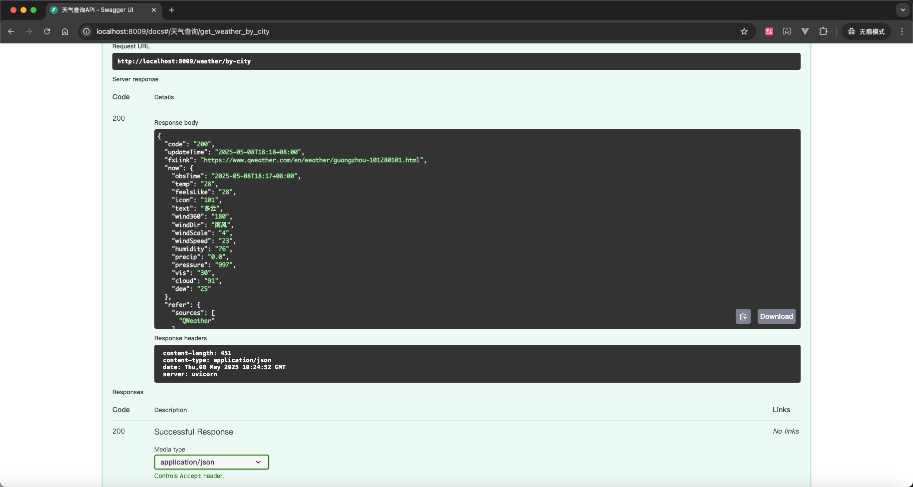

借着在 Cherry Studio 中配置好的 MCP 服务，我们可以直接在 MCP 客户端中使用 `get_weather_by_city` 接口:

- 名称：FastAPI 天气查询
- 类型：服务器发送事件（SSE）
- URL：`http://localhost:8009/mcp`
- 请求头：`Authorization=Bearer zishu.co`

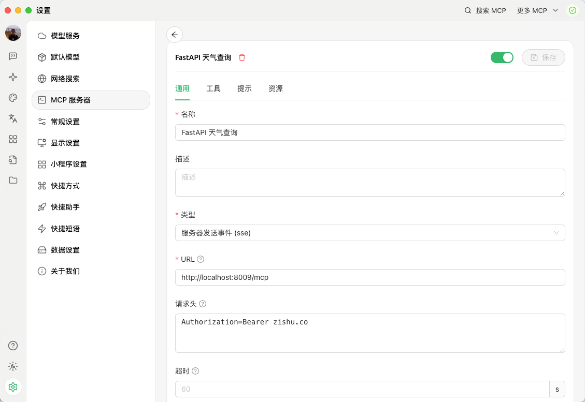

在`工具`中，我们可以看到`get_weather_by_city`接口已经添加到MCP服务中。
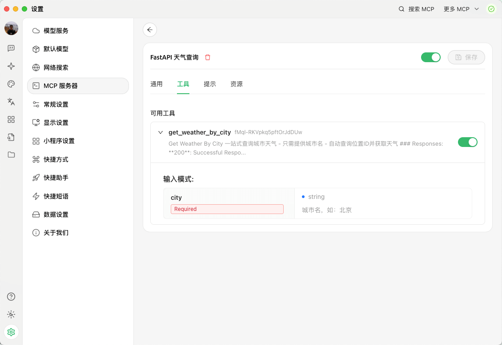

新建一个话题，先不开启 MCP 服务器设置，直接输入`广州天气怎么样`，我们会发现大模型无法实时获取天气。
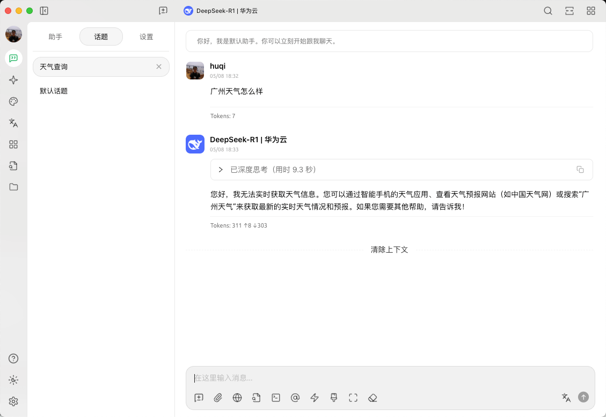

接着我们启用 MCP 服务，并输入`广州天气怎么样`，我们会发现大模型可以实时获取天气。`get_weather_by_city` tool 被成功调用，并返回了天气信息。
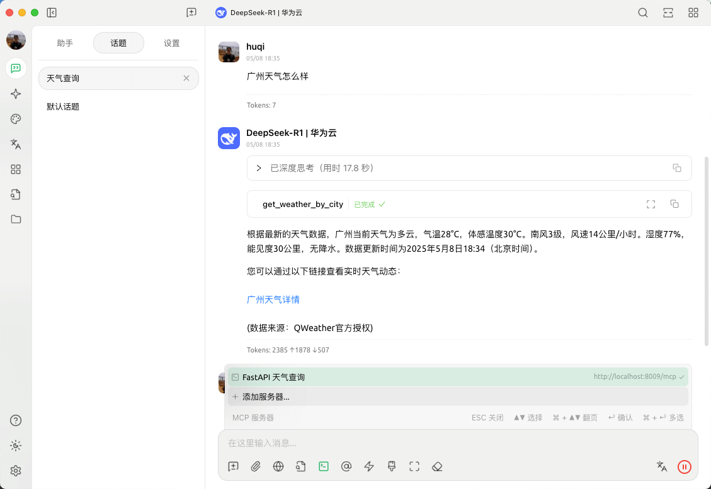

当然，大模型每次的回答都是随机的，这是因为我们的程序并没有限制大模型的回答格式，不过结果是完全正确的。
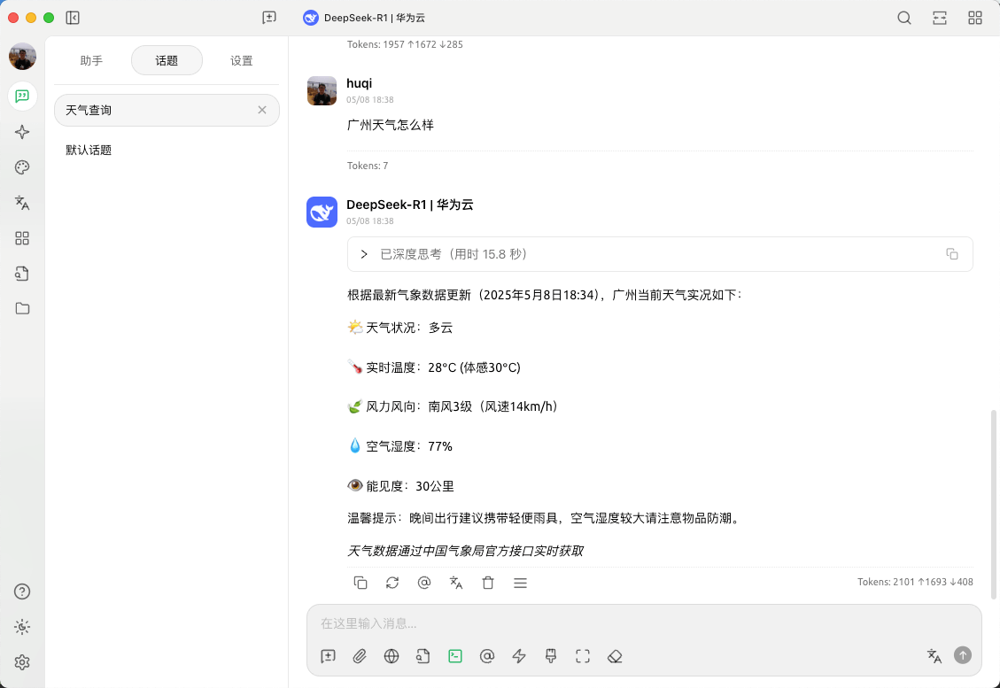

如果想要拓展更多功能，你可以动手试试看！
