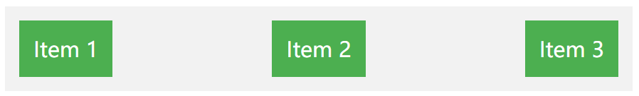
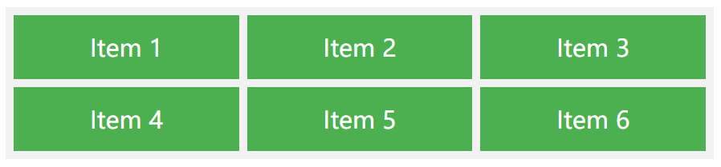
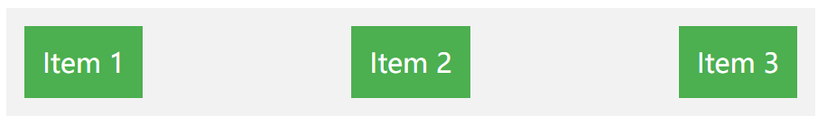
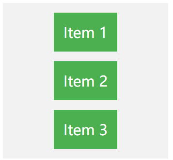

## 目录

* 第01课-什么是css

#### task01 css选择器

* 第02课-常见css选择器

#### task02 css美化图像

* 第03课-图像格式及特点

* 第04课-在网页中插入图像

* 第05课-设置图像样式

#### task03 css美化超链接

* 第06课-超链接

* 第7课-什么是超链接

#### task04 css美化

* 第8课-列表美化

* 第9课-表格美化

* 第10课-表单美化

* 第11课-其他常见css美化技巧

#### task05 css布局基础

* 第12课-布局方式

#### task06 css+html5网页排版

* 第13课-html5结构

* 第14课-css在html布局的应用

#### task07 css动画

* 第15课-css动画基础概念

* 第16课-创建动画

* 第17课-动画核心属性

* 第18课-常见动画效果

# css概述

CSS是网页设计不可或缺的一部分，它不仅为网站提供了必要的样式和布局控制，还确保了网页的响应性和交互性。以下是对CSS的概述与重要性的详细介绍：

1. **CSS的定义和作用**：

   * CSS（层叠样式表）是一种用来增强HTML文档表现形式的语言，它能够控制网页中的字体、颜色、布局、边框、背景等视觉效果。

   * 通过将样式与HTML分离，CSS使网页的样式和布局更加灵活、可维护和可扩展。

2. **CSS的工作原理**：

   * CSS的工作开始于浏览器解析HTML和CSS文件，分别转化为DOM树和CSSOM树。

   * 接下来，浏览器将两棵树匹配，确定每个元素应用哪些样式，并根据这些信息渲染网页。

   * 层叠和继承是CSS的核心特征，它们定义了多个样式规则应用于同一元素时如何决定最终样式，以及某些样式如何被子元素继承。

3. **CSS的重要性**：

   * **美化页面**：CSS为HTML内容提供美观的视觉外观，使得网页不仅仅是文本和链接的堆砌，而是具有吸引力的视觉体验。

   * **提高可维护性**：与传统的HTML属性相比，CSS提供了更高的代码重用性和维护性，特别是在使用外部样式表时，可以方便地更新整个网站的样式。

   * **响应式设计**：CSS使得开发者可以为不同的屏幕尺寸和设备类型创建响应式布局，随着移动设备的普及，这一点变得尤为重要。

CSS在现代网页设计和开发中扮演着至关重要的角色。从基本的样式设置到复杂的布局构建，再到动画和交互效果的实现，CSS的应用广泛且深入。掌握CSS不仅是前端开发者的基本技能，也是提升用户体验、创造现代化网页的关键步骤。

# css选择器

CSS（层叠样式表）提供了多种选择器，用于选择要应用样式的 HTML 元素。

CSS 选择器用于选择你想要的元素的样式的模式。

下列表格中的 "CSS" 列表示在 CSS 版本的属性定义，CSS1、CSS2 和 CSS3 是层叠样式表（Cascading Style Sheets）的不同版本，每个版本引入了新的特性和功能，以改进网页样式的控制和设计。

## 常见的 CSS 选择器

下是一些常见的 CSS 选择器：

### **元素选择器（Element Selector）**

通过元素名称选择 HTML 元素。

如下代码，**`p`** 选择器将选择所有 **`<p>`** 元素：

```css
p {
  color: blue;
}
```

### **类选择器（Class Selector）**

通过类别名称选择具有特定类别的 HTML 元素。

类选择器以 **`.`** 开头，后面跟着类别名称。

如下代码，**`.highlight`** 选择器将选择所有具有类别为 **`"highlight"`** 的元素。

```css
.highlight {
  background-color: yellow;
}
```

### **ID 选择器（ID Selector）**

通过元素的唯一标识符（ID）选择 HTML 元素。

ID 选择器以 **`#`** 开头，后面跟着 ID 名称。

如下代码，**`#zishu`** 选择器将选择具有 ID 为 **`"zishu"`** 的元素。

```css
#zishu {
  width: 200px;
}
```

### **属性选择器（Attribute Selector）**

通过元素的属性选择 HTML 元素。

属性选择器可以根据属性名和属性值进行选择。

如下代码，**`input[type="text"]`** 选择器将选择所有 **`type`** 属性为 **`"text"`** 的 `<input>` 元素。

```css
input[type="text"] {
  border: 1px solid gray;
}
```

### **后代选择器（Descendant Selector）**

通过指定元素的后代关系选择 HTML 元素。

后代选择器使用空格分隔元素名称。

如下代码，`div p` 选择器将选择所有在 `<div>` 元素内的 `<p>` 元素。

```css
div p {
  font-weight: bold;
}
```

### **子元素选择器（Child Selector）**

通过指定元素的直接子元素关系选择 HTML 元素。

子元素选择器使用 `>` 符号分隔父元素和子元素。

例如，`ul > li` 选择器将选择所有 `<ul>` 元素的直接子元素中的 `<li>` 元素。

```css
ul > li {
  line-height: 2em;
}
```

### **相邻兄弟选择器（Adjacent Sibling Selector）**

通过指定元素之间的相邻兄弟关系选择 HTML 元素。

相邻兄弟选择器使用 `+` 符号分隔两个相邻元素。

例如，`h2 + p` 选择器将选择紧接在 `<h2>` 元素后的 `<p>` 元素。

```css
h2 + p {
  padding: 10px;
}
```

### **通用选择器（Universal Selector）**

选择所有 HTML 元素。

通用选择器使用 `*` 符号。

例如，`*` 选择器将选择页面上的所有元素。

更多选择器可以参考以下表格：

| 选择器                                                                                          | 示例                    | 示例说明                                     | CSS |
| -------------------------------------------------------------------------------------------- | --------------------- | ---------------------------------------- | --- |
| [.*class*](https://www.runoob.com/cssref/sel-class.html)                                     | .intro                | 选择所有class="intro"的元素                     | 1   |
| [#*id*](https://www.runoob.com/cssref/sel-id.html)                                           | #firstname            | 选择所有id="firstname"的元素                    | 1   |
| [\*](https://www.runoob.com/cssref/sel-all.html)                                             | \*                    | 选择所有元素                                   | 2   |
| [*element*](https://www.runoob.com/cssref/sel-element.html)                                  | p                     | 选择所有\<p>元素                               | 1   |
| [*element,element*](https://www.runoob.com/cssref/sel-element-comma.html)                    | div,p                 | 选择所有\<div>元素和 \<p> 元素                    | 1   |
| [elemen&#x74;*.class*](https://www.runoob.com/cssref/sel-element-class.html)                 | p.hometown            | 选择所有 class="hometown" 的 \<p> 元素          | 1   |
| [*element* *element*](https://www.runoob.com/cssref/sel-element-element.html)                | div p                 | 选择\<div>元素内的所有\<p>元素                     | 1   |
| [*element*>*element*](https://www.runoob.com/cssref/sel-element-gt.html)                     | div>p                 | 选择所有父级是 \<div> 元素的 \<p> 元素               | 2   |
| [*element*+*element*](https://www.runoob.com/cssref/sel-element-pluss.html)                  | div+p                 | 选择所有紧跟在 \<div> 元素之后的第一个 \<p> 元素          | 2   |
| [\[*attribute*\]](https://www.runoob.com/cssref/sel-attribute.html)                          | \[target]             | 选择所有带有target属性元素                         | 2   |
| [\[*attribute*=*value*\]](https://www.runoob.com/cssref/sel-attribute-value.html)            | \[target=-blank]      | 选择所有使用target="-blank"的元素                 | 2   |
| [\[*attribute*\~=*value*\]](https://www.runoob.com/cssref/sel-attribute-value-contains.html) | \[title\~=flower]     | 选择标题属性包含单词"flower"的所有元素                  | 2   |
| [\[*attribute*\|=*language*\]](https://www.runoob.com/cssref/sel-attribute-value-lang.html)  | \[lang\|=en]          | 选择 lang 属性等于 **en**，或者以 **en-** 为开头的所有元素 | 2   |
| [:link](https://www.runoob.com/cssref/sel-link.html)                                         | a:link                | 选择所有未访问链接                                | 1   |
| [:visited](https://www.runoob.com/cssref/sel-visited.html)                                   | a:visited             | 选择所有访问过的链接                               | 1   |
| [:active](https://www.runoob.com/cssref/sel-active.html)                                     | a:active              | 选择活动链接                                   | 1   |
| [:hover](https://www.runoob.com/cssref/sel-hover.html)                                       | a:hover               | 选择鼠标在链接上面时                               | 1   |
| [:focus](https://www.runoob.com/cssref/sel-focus.html)                                       | input:focus           | 选择具有焦点的输入元素                              | 2   |
| [:first-letter](https://www.runoob.com/cssref/sel-firstletter.html)                          | p:first-letter        | 选择每一个\<p>元素的第一个字母                        | 1   |
| [:first-line](https://www.runoob.com/cssref/sel-firstline.html)                              | p:first-line          | 选择每一个\<p>元素的第一行                          | 1   |
| [:first-child](https://www.runoob.com/cssref/sel-firstchild.html)                            | p:first-child         | 指定只有当\<p>元素是其父级的第一个子级的样式。                | 2   |
| [:before](https://www.runoob.com/cssref/sel-before.html)                                     | p:before              | 在每个\<p>元素之前插入内容                          | 2   |
| [:after](https://www.runoob.com/cssref/sel-after.html)                                       | p:after               | 在每个\<p>元素之后插入内容                          | 2   |
| [:lang(*language*)](https://www.runoob.com/cssref/sel-lang.html)                             | p:lang(it)            | 选择一个lang属性的起始值="it"的所有\<p>元素             | 2   |
| [*element1*\~*element2*](https://www.runoob.com/cssref/sel-gen-sibling.html)                 | p\~ul                 | 选择p元素之后的每一个ul元素                          | 3   |
| [\[*attribute*^=*value*\]](https://www.runoob.com/cssref/sel-attr-begin.html)                | a\[src^="https"]      | 选择每一个src属性的值以"https"开头的元素                | 3   |
| [\[*attribute*$=*value*\]](https://www.runoob.com/cssref/sel-attr-end.html)                  | a\[src$=".pdf"]       | 选择每一个src属性的值以".pdf"结尾的元素                 | 3   |
| [\[*attribute*\*=*value*\]](https://www.runoob.com/cssref/sel-attr-contain.html)             | a\[src\*="runoob"]    | 选择每一个src属性的值包含子字符串"runoob"的元素            | 3   |
| [:first-of-type](https://www.runoob.com/cssref/sel-first-of-type.html)                       | p:first-of-type       | 选择每个p元素是其父级的第一个p元素                       | 3   |
| [:last-of-type](https://www.runoob.com/cssref/sel-last-of-type.html)                         | p:last-of-type        | 选择每个p元素是其父级的最后一个p元素                      | 3   |
| [:only-of-type](https://www.runoob.com/cssref/sel-only-of-type.html)                         | p:only-of-type        | 选择每个p元素是其父级的唯一p元素                        | 3   |
| [:only-child](https://www.runoob.com/cssref/sel-only-child.html)                             | p:only-child          | 选择每个p元素是其父级的唯一子元素                        | 3   |
| [:nth-child(*n*)](https://www.runoob.com/cssref/sel-nth-child.html)                          | p:nth-child(2)        | 选择每个p元素是其父级的第二个子元素                       | 3   |
| [:nth-last-child(*n*)](https://www.runoob.com/cssref/sel-nth-last-child.html)                | p:nth-last-child(2)   | 选择每个p元素的是其父级的第二个子元素，从最后一个子项计数            | 3   |
| [:nth-of-type(*n*)](https://www.runoob.com/cssref/sel-nth-of-type.html)                      | p:nth-of-type(2)      | 选择每个p元素是其父级的第二个p元素                       | 3   |
| [:nth-last-of-type(*n*)](https://www.runoob.com/cssref/sel-nth-last-of-type.html)            | p:nth-last-of-type(2) | 选择每个p元素的是其父级的第二个p元素，从最后一个子项计数            | 3   |
| [:last-child](https://www.runoob.com/cssref/sel-last-child.html)                             | p:last-child          | 选择每个p元素是其父级的最后一个子级。                      | 3   |
| [:root](https://www.runoob.com/cssref/sel-root.html)                                         | :root                 | 选择文档的根元素                                 | 3   |
| [:empty](https://www.runoob.com/cssref/sel-empty.html)                                       | p:empty               | 选择每个没有任何子级的p元素（包括文本节点）                   | 3   |
| [:target](https://www.runoob.com/cssref/sel-target.html)                                     | #news:target          | 选择当前活动的#news元素（包含该锚名称的点击的URL）            | 3   |
| [:enabled](https://www.runoob.com/cssref/sel-enabled.html)                                   | input:enabled         | 选择每一个已启用的输入元素                            | 3   |
| [:disabled](https://www.runoob.com/cssref/sel-disabled.html)                                 | input:disabled        | 选择每一个禁用的输入元素                             | 3   |
| [:checked](https://www.runoob.com/cssref/sel-checked.html)                                   | input:checked         | 选择每个选中的输入元素                              | 3   |
| [:not(*selector*)](https://www.runoob.com/cssref/sel-not.html)                               | :not(p)               | 选择每个并非p元素的元素                             | 3   |
| [::selection](https://www.runoob.com/cssref/sel-selection.html)                              | ::selection           | 匹配元素中被用户选中或处于高亮状态的部分                     | 3   |
| [:out-of-range](https://www.runoob.com/cssref/sel-out-of-range.html)                         | :out-of-range         | 匹配值在指定区间之外的input元素                       | 3   |
| [:in-range](https://www.runoob.com/cssref/sel-in-range.html)                                 | :in-range             | 匹配值在指定区间之内的input元素                       | 3   |
| [:read-write](https://www.runoob.com/cssref/sel-read-write.html)                             | :read-write           | 用于匹配可读及可写的元素                             | 3   |
| [:read-only](https://www.runoob.com/cssref/sel-read-only.html)                               | :read-only            | 用于匹配设置 "readonly"（只读） 属性的元素              | 3   |
| [:optional](https://www.runoob.com/cssref/sel-optional.html)                                 | :optional             | 用于匹配可选的输入元素                              | 3   |
| [:required](https://www.runoob.com/cssref/sel-required.html)                                 | :required             | 用于匹配设置了 "required" 属性的元素                 | 3   |
| [:valid](https://www.runoob.com/cssref/sel-valid.html)                                       | :valid                | 用于匹配输入值为合法的元素                            | 3   |
| [:invalid](https://www.runoob.com/cssref/sel-invalid.html)                                   | :invalid              | 用于匹配输入值为非法的元素                            | 3   |
| [:has](https://www.runoob.com/cssref/css-sel-has.html)                                       | :has                  | 允许根据其后代元素来选择一个元素。                        | 3   |
| [:is](https://www.runoob.com/cssref/css-sel-is.html)                                         | :is                   | 接收任何数量的选择器作为参数，并且返回这些选择器匹配的元素的并集。        | 3   |


# css美化图像

1. 图像格式及特点

   1. 网页常用的格式有3种：GIF、JPEG和PNG,下面简单介绍三种图像格式及特点

   2. GIF图像：适合简单图形和动画，支持无损压缩和单色透明。

      1. **色彩支持**：支持 **256种颜色**（8位色），因此更适合色彩较少的图像，如简单的图标、按钮、线条图等。

      2. **透明度**：支持 **单色透明**，可以将图像的某个颜色设为透明，但不支持半透明效果。

      3. **动画支持**：GIF 是目前最常用的网页 **动画格式**，可支持简单的帧动画。

      4. **压缩方式**：使用 **无损压缩**，即在压缩时不会丢失图像质量。

      5. **应用场景**：适合小型动画、低色彩图像、简单图标等。

   3. jpeg图像：适合照片和复杂色彩图像，使用有损压缩，不支持透明。

      1. **色彩支持**：支持 **1600万种颜色**（24位色），适合色彩丰富、渐变平滑的图像，如照片和复杂的插图。

      2. &#x20;**透明度**：不支持透明效果。

      3. &#x20;**压缩方式**：使用 **有损压缩**，即在压缩时图像会丢失部分细节，但可以通过调整压缩级别来平衡质量与文件大小。

      4. &#x20;**应用场景**：适合照片、复杂图片、网页中的大型图像。因为支持高色彩和渐变，但不适合需要透明效果或动画的图像。

   4. png图像：支持高质量图像、复杂透明效果，使用无损压缩，适合需要透明度和高质量的图像。

      1. **色彩支持**：有两种主要类型：

      2. **PNG-8**：支持 **256种颜色**，与GIF类似，适合色彩较少的简单图像。

      3. **PNG-24**：支持 **1600万种颜色**，与JPEG类似，适合高色彩图片。

      4. **透明度**：支持 **全透明** 和 **半透明**，可以进行复杂的透明效果，适合需要透明背景的图像。

      5. **压缩方式**：使用 **无损压缩**，即压缩时不会丢失图像质量。

      6. **应用场景**：适合有透明背景的图像、图标、需要高质量显示的图片。

2. 在网页中插入图像

   1. 使用 \ 标签在 HTML 中插入图像。\ 是一个自闭合标签，有两个必须的属性：

   2. src: 指定图像文件的路径（可以是本地文件路径或网络地址）。

   3. &#x20;alt: 为图像提供替代文本，当图像无法显示时，浏览器会显示此文本。

3. 设置图像样式

   1. 图像大小

      * css提供了width （定义图像的宽度，区直单位可以是像素px或者百分比%）和height（定义图像的高度，取值单位可以是像素px或百分比%）属性，使用这两个属性可以实现结构和表现相分离

      * 指定固定宽度和高度

      ```sql
      img {
          width: 300px;   /* 宽度设置为300像素 */
          height: 200px;  /* 高度设置为200像素 */
      }
      ```

      * 只设置宽度或高度

        * 为了避免图像变形，可以只设置 width 或 height，而将另一个值设置为 auto。这样图像的宽高比会自动保持不变。

        ```sql
        img {
            width: 300px;   /* 宽度设置为300像素 */
            height: auto;   /* 高度根据宽度自动调整，保持比例 */
        }
        ```

      * 使用百分比设置尺寸

        * 使用百分比可以让图像的尺寸相对于父容器进行缩放，常用于响应式设计，使图像随着屏幕大小变化而调整。

        ```sql
        img {
            width: 50%;     /* 图像宽度为其父容器宽度的50% */
            height: auto;   /* 高度自动调整，保持比例 */
        }
        ```

      * 最大宽度设置

        * 为了确保图像不会超出容器的宽度，可以使用 max-width 属性。该属性会限制图像的最大宽度，当父容器宽度变小时，图像会相应缩小。

        ```sql
        img {
            max-width: 100%;  /* 图像最大宽度为父容器的100% */
            height: auto;     /* 高度自动调整 */
        }
        ```

   2. 图像边框

      css的border属性不仅可以为图像定义边框，而且提供了丰富分边框样式，支持定义边框的粗细，颜色和样式。border 属性用于设置边框的宽度、样式和颜色，可以一次性声明这三个值，也可以分别设置。

      **样式**：定义边框的样式，常见的样式有：

      &#x20;虚线框：&#x20;

      dashed：虚线

      &#x20;dotted：点线

      &#x20;实线框：

      &#x20;solid：实线

      double：双线

      groove：凹槽线

      ridge：凸线

      &#x20;inset：内嵌效果

      outset：外凸效果

      **颜色**（black）：定义边框的颜色，支持颜色名称、十六进制值、RGB、RGBA 等。

      提示：双线框由两条单线和中间的空隙组成

      边框样式

      ```sql
      img {
          border: 2px solid black;   /* 2像素宽的实线黑色边框 */
      }
      ```

      * **只设置某一侧的边框**

      ```sql
      img {
          border-top: 2px solid red;       /* 只为上边框设置 */
          border-right: 5px dashed blue;   /* 只为右边框设置 */
          border-bottom: 3px double green; /* 只为下边框设置 */
          border-left: 4px dotted black;   /* 只为左边框设置 */
      }
      ```

      1. 边框宽度颜色

      ```sql
      img {
          border-width: 2px;         /* 边框宽度 */
          border-style: solid;       /* 边框样式 */
          border-color: black;       /* 边框颜色 */
      }
      ```

      * 圆角边框：通过 border-radius 属性可以设置图像的圆角边框，圆角的半径可以用像素、百分比等单位定义。

      ```sql
      img {
          border: 2px solid black;         /* 设置边框 */
          border-radius: 10px;             /* 所有四个角的圆角半径为10像素 */
      }
      ```

      * 设定特定位置圆角

      ```sql
      img {
          border: 2px solid black;
          border-top-left-radius: 20px;    /* 左上角圆角半径为20像素 */
          border-bottom-right-radius: 30px;/* 右下角圆角半径为30像素 */
      }
      ```

   3. 图像的对齐方式

      1. **浮动对齐 (float)**

         使用 float 属性可以让图像在页面中向左或向右浮动，通常用于文本环绕图像的布局。

         向左浮动

         ```sql
         img {
             float: left;
             margin-right: 10px;  /* 为图像右侧添加 10px 的空白，避免文本紧贴图像 */
         }
         ```

      向右浮动

      **图像与文本顶部或底部对齐**

      图像靠左或靠右对齐

      **垂直排列图像：**&#x53EF;以使用 display: block; 将图像设置为块级元素，每张图像都会在下一行显示。


   4. 图像的透明度

      **CSS** 的 opacity 属性来设置图像的透明度。透明度的设置可以使图像变得部分或完全透明，在视觉上实现渐变、重叠效果或其他特殊设计效果。

      **0** 表示完全透明，即不可见。

      &#x20;**1** 表示完全不透明，即元素显示为正常的视觉效果。

      中间的值（如 0.5）表示半透明。

      ```sql
      img {
          opacity: 0.5;   /* 将图像设置为50%的透明度 */
      }
      ```

      在使用图像透明度时，有几点建议：

      **背景与内容的对比**：确保透明图像与背景有足够的对比，以便图像内容仍然清晰可见。

      **响应式设计**：在响应式设计中，透明图像可以随设备屏幕调整大小，并且透明度效果可以帮助减少图像视觉上的压力。

      &#x20;**性能**：频繁使用高透明度或大面积透明图像可能会影响页面性能，尤其是在复杂布局中，需注意性能优化。

   5. 圆角图像

      &#x20;border-radius 属性可以轻松实现 **圆角图像**，甚至可以将图像裁剪为**圆形**。下面将详细介绍如何实现不同的圆角效果。

      **四个角统一设置圆角**

      ```sql
      img {
          border-radius: 20px;  /* 四个角的圆角半径为 20px */
      }
      ```

      **不同角设置不同的圆角**

      可以为每个角分别设置不同的圆角半径，来实现更加复杂的形状。border-radius 接受最多四个值，按顺序对应 **左上角**、**右上角**、**右下角** 和 **左下角**。

      ```sql
      img {
          border-top-left-radius: 30px;     /* 左上角圆角为 30px */
          border-top-right-radius: 10px;    /* 右上角圆角为 10px */
          border-bottom-right-radius: 50px; /* 右下角圆角为 50px */
          border-bottom-left-radius: 5px;   /* 左下角圆角为 5px */
      }
      ```

      **将图像裁剪为圆形**

      要将图像设置为圆形，可以将 border-radius 设置为 **50%**。这种方法通常用于将方形或接近方形的图像变成圆形，常见于头像等场景。

      **注意**：为了确保图像变成真正的圆形，图像的宽度和高度应该相等。如果图像是矩形的，圆角将导致椭圆形效果。

      **百分比和像素的差异**

      border-radius 可以使用 **像素（px）** 或 **百分比（%）** 来定义圆角的半径。

      &#x20;      **百分比**：可以适应图像大小变化，尤其在响应式设计中有较大的灵活性。


   6. 图像阴影

      &#x20;**CSS** 的 box-shadow 属性来实现。阴影效果能为图像增加深度和立体感，使其在视觉上更加突出。box-shadow 提供了非常灵活的阴影设置，可以控制阴影的大小、模糊度、方向和颜色。

      下面是关于如何使用 box-shadow 属性为图像添加阴影的详细说明。

      **offset-x**：阴影在水平方向上的偏移量（正值向右，负值向左）。

      **offset-y**：阴影在垂直方向上的偏移量（正值向下，负值向上）。

      **blur-radius**（可选）：模糊半径，定义阴影的模糊程度（值越大，阴影越模糊）。

      **spread-radius**（可选）：扩展半径，控制阴影的大小（正值扩展，负值缩小）。

      **color**：阴影的颜色，支持常见的颜色格式（如 rgba() 可以定义带透明度的颜色）。

      基本阴影效果

      ```css
      img {
        width: 300px;
        height: 200px;
        box-shadow: 10px 10px 0px 0px rgba(0, 0, 0, 0.5); /* 水平偏移 10px，垂直偏移 10px，阴影颜色为黑色，透明度为 0.5 */
      }
      ```

      增加模糊效果

      如果想让阴影看起来更加柔和，可以增加 `blur-radius`。

      ```css
      img {
        width: 300px;
        height: 200px;
        box-shadow: 10px 10px 15px 0px rgba(0, 0, 0, 0.5); /* 模糊半径为 15px */
      }
      ```

      扩展和收缩阴影

      使用 `spread-radius` 可以让阴影更大或更小。

      ```css
      img {
        width: 300px;
        height: 200px;
        box-shadow: 10px 10px 15px 20px rgba(0, 0, 0, 0.5); /* 阴影向外扩展 20px */
      }
      ```

      多重阴影

      `box-shadow` 还支持多个阴影效果，你可以为一个元素添加多个阴影，每个阴影之间使用逗号分隔。

      ```css
      img {
        width: 300px;
        height: 200px;
        box-shadow: 5px 5px 10px rgba(0, 0, 0, 0.3), -5px -5px 10px rgba(0, 0, 0, 0.3);
        /* 第一个阴影偏移 5px 向下，第二个阴影偏移 -5px 向上，透明度分别为 0.3 */
      }
      ```

      使用不同的颜色和透明度

      `box-shadow` 允许使用 `rgba()` 来定义带透明度的颜色，从而让阴影更加柔和。

      ```css
      img {
        width: 300px;
        height: 200px;
        box-shadow: 10px 10px 20px rgba(0, 0, 0, 0.3); /* 使用 rgba 设置透明度 */
      }
      ```

# css美化超链接

1. 超链接

   1. 内部链接：指向网站内部的页面或资源，通常用于引导用户在同一域名下的页面之间进行导航。

   2. 锚点链接：指向当前页面或其他页面的特定部分，通常用于跳转到页面中的某个位置，比如标题、段落、或其他特定元素。

   3. 外部链接：指向其他域名下的网页或资源，用于将用户引导到不同的网站或外部资源。

2. 设置超链接

   超链接（`<a>` 标签）是非常常见的元素，用于导航到其他页面或网站。为了提高用户体验并使网站更具吸引力，常常需要对超链接进行美化。通过 CSS，我们可以灵活地控制超链接的外观，包括颜色、背景、边框、文本样式、过渡效果等。

   以下是对超链接美化的详细教程，涵盖了常用的 CSS 属性和一些实用的美化技巧。

   1. 伪类

   2. **基础样式**

   首先，我们需要为超链接应用一些基础样式，例如颜色、字体、文本装饰等。

   #### **基本的超链接样式**：

   ```css
   /* 基本超链接样式 */
   a {
     color: #007bff; /* 设置超链接的文本颜色 
   /
   *  text-decoration: none; /*
    移除默认的下划线 
   /
   *  font-weight: bold; /*
    设置字体加粗 */
   }
   ```

   * `color`：设置超链接的文本颜色，通常使用一个鲜艳的颜色来突出显示。

   * `text-decoration`：默认情况下，超链接会有下划线，通过 `text-decoration: none` 可以去掉这个下划线。

   * `font-weight`：将文本设置为加粗，增强其可读性和吸引力。

   2. **修改超链接的颜色和去掉下划线**

      ```sql
      a {
          color: #3498db;       /* 修改链接文本颜色为蓝色 */
          text-decoration: none; /* 去掉默认的下划线 */
      }
      ```

   3. **超链接的悬停效果（Hover）**

   为了提升用户交互体验，我们通常会为超链接添加悬停效果，使得用户在鼠标经过时能看到变化。最常见的效果是改变颜色、添加背景色、以及下划线效果。

   #### **添加悬停效果**：

   ```css
   /* 设置悬停时的样式 */
   a:hover {
     color: #0056b3; /* 更改文本颜色 
   /
   *  text-decoration: underline; /*
    添加下划线 
   /
   *  background-color: #f0f0f0; /*
    设置背景色 */
   }
   ```

   * `a:hover`：这个选择器会在用户将鼠标悬停在链接上时触发。

   * `color`：改变文本颜色，通常使用稍深的颜色来显示悬停状态。

   * `text-decoration`：在悬停时添加下划线，给用户一个明确的交互提示。

   * `background-color`：可以设置背景色，给超链接一个视觉上的反馈。

   ***

   * **点击后的样式（Active）**

   点击链接时，它会呈现出 "活动" 状态。我们可以通过 CSS 来美化这个状态，使它与普通状态和悬停状态有所区别。

   #### **点击后的样式**：

   ```css
   /* 设置点击后的样式 */
   a:active {
     color: #004085; /* 设置点击时的文本颜色 
   /
   *  background-color: #d6e9f8; /*
    点击时的背景色 */
   }
   ```

   * `a:active`：这个选择器应用于用户点击链接时。

   * `color` 和 `background-color`：设置点击时的文本和背景颜色，通常选择一些更深或更明显的颜色变化，以便用户清楚地知道链接已经被点击。

   ***

   * **超链接的聚焦效果（Focus）**

   当用户通过键盘导航（如 Tab 键）聚焦于链接时，我们可以为超链接添加一个聚焦效果，通常使用边框或背景色来强调聚焦元素。

   #### **聚焦效果**：

   ```css
   /* 设置聚焦时的样式 */
   a:focus {
     outline: 2px solid #ff9900; /* 为聚焦状态添加一个橙色的外框 
   /
   *  background-color: #ffffcc; /*
    改变聚焦时的背景色 */
   }
   ```

   * `a:focus`：该选择器在元素获得键盘焦点时触发（例如用户使用 Tab 键聚焦到该链接）。

   * `outline`：设置一个明显的轮廓来突出显示聚焦元素，通常使用亮眼的颜色。

   * `background-color`：改变聚焦时的背景颜色，通常选择一种淡色，确保不分散注意力。

   ***

   * **平滑过渡效果**

   为了让超链接的状态切换更加平滑，我们可以使用 CSS 过渡效果（`transition`）来实现颜色、背景和其他样式的平滑过渡。过渡可以改善用户体验，使得视觉效果更加流畅。

   #### **添加平滑过渡效果**：

   ```css
   /* 为超链接添加平滑的过渡效果 */
   a {
     color: #007bff;
     text-decoration: none;
     font-weight: bold;
     transition: color 0.3s ease, background-color 0.3s ease; /* 为颜色和背景颜色添加过渡 */
   }
   /* 悬停时的样式 */
   a:hover {
     color: #0056b3;
     text-decoration: underline;
     background-color: #f0f0f0;
   }
   ```

   * `transition`：这个属性让元素的状态变化更加平滑。这里设置了颜色（`color`）和背景颜色（`background-color`）的过渡时间为 0.3 秒，过渡效果为 `ease`（即加速后减速的效果）。

   ***

   * **为链接添加图标**

   为了使链接更具吸引力，许多网站会为超链接添加图标。通过 `::before` 或 `::after` 伪元素可以轻松实现图标的插入。

   #### **添加图标**：

   ```css
   /* 为链接添加一个箭头图标 */
   a::after {
     content: " →"; /* 添加箭头 
   /
   *  font-size: 1.2em; /*
    设置图标的大小 
   /
   *  color: #007bff; /*
    设置图标的颜色 
   /
   *  margin-left: 5px; /*
    设置图标和文本之间的间距 */
   }
   ```

   * `content`：通过 `::after` 伪元素，使用 `content` 属性添加文本或符号。

   * `font-size`：设置图标的大小，使其与文本保持协调。

   * `margin-left`：给图标和文本之间添加间距，使其不显得拥挤。

   ***

   * **响应式设计**

   为了适应不同屏幕尺寸，超链接的样式应该具有响应性。例如，在移动设备上，可以适当增大链接的点击区域，或者改变链接的颜色和大小以适应不同的布局。

   #### **响应式样式**：

   ```css
   /* 默认的超链接样式 */
   a {
     color: #007bff;
     font-size: 16px;
     padding: 8px;
   }
   /* 在小屏幕设备上，增大字体和按钮大小 */
   @media (max-width: 600px) {
     a {
       font-size: 18px;
       padding: 12px;
     }
   }
   ```

   * `@media`：媒体查询用于根据不同屏幕尺寸应用不同的样式。此示例中，当屏幕宽度小于或等于 600px 时，增大链接的字体和内边距。

# CSS 美化

#### 1. 列表（List）的美化

列表是网页中常见的元素，CSS 可以用来对其进行美化，包括调整间距、字体、颜色等。以下是列表美化的技巧和代码示例：


##### 1.1 列表项样式

* **调整间距**：增加列表项之间的间距，使其更清晰。

* **自定义项目符号**：使用 `list-style-type` 属性自定义符号或图标。

* **字体样式**：更改字体、颜色、大小等来匹配网页设计风格。


```css
ul {
    list-style-type: disc;
    padding-left: 20px;
    margin: 10px 0;
    font-family: Arial, sans-serif;
    font-size: 16px;
    color: #333;
}

ul li {
    margin-bottom: 8px;
}

ul li::marker {
    color: #ff6347;
    font-size: 20px;
}
```


##### 1.2 列表项目的 hover 效果

* **背景色变化**：悬停时改变背景色。

* **动画效果**：使用 `transition` 让效果更平滑。


```css
ul li:hover {
    background-color: #f0f0f0;
    transition: background-color 0.3s ease;
}
```


#### 2. 表格（Table）的美化

1. 表格结构

   **`<table>`**：代表表格的容器元素，用来定义表格。

   **`<tr>`**：表示表格的一行（table row）。

   **`<td>`**：表示表格中的单元格（table data）。

   **`<th>`**：表示表格中的表头单元格（table header）。

表格用于展示结构化数据，CSS 可以增强表格的可读性和视觉效果。以下是一些表格美化的方法：


##### 2.1 表格边框和间距

* **单元格间距**：使用 `border-spacing` 调整单元格之间的间距。

* **边框样式**：为表格和单元格添加边框，使其更清晰。


```css
table {
    width: 100%;
    border-collapse: collapse;
    border-spacing: 0;
    font-family: Arial, sans-serif;
}

table, th, td {
    border: 1px solid #ddd;
}

th, td {
    padding: 12px;
    text-align: left;
}
```


##### 2.2 表头样式

* **背景色和字体**：为表头设置不同的背景色和字体样式，突出重要性。


```css
th {
    background-color: #4CAF50;
    color: white;
    font-size: 18px;
}
```


##### 2.3 隔行变色

* **斑马线样式**：通过 `nth-child` 选择器设置隔行背景色，提升可读性。


```css
tr:nth-child(even) {
    background-color: #f2f2f2;
}
```


#### 3. 表单（Form）的美化


表单是用户与网页互动的重要部分，CSS 可以用来提升表单的视觉效果和用户体验。


##### 3.1 输入框（Input）样式

* **圆角和阴影**：让输入框看起来更现代化。

* **边框样式**：定制边框的颜色和宽度。


```css
input[type="text"], input[type="email"], textarea {
    width: 100%;
    padding: 10px;
    margin: 8px 0;
    box-sizing: border-box;
    border: 2px solid #ccc;
    border-radius: 4px;
    font-size: 16px;
}

input[type="text"]:focus, input[type="email"]:focus {
    border-color: #4CAF50;
    box-shadow: 0 0 5px rgba(76, 175, 80, 0.8);
}
```


##### 3.2 按钮样式

* **渐变背景和动画**：使用渐变背景和轻微动画增加按钮的视觉吸引力。


```css
button {
    background: linear-gradient(to right, #4CAF50, #45a049);
    border: none;
    color: white;
    padding: 12px 20px;
    text-align: center;
    text-decoration: none;
    display: inline-block;
    font-size: 16px;
    margin: 8px 0;
    cursor: pointer;
    border-radius: 4px;
    transition: background 0.3s ease;
}

button:hover {
    background: linear-gradient(to right, #45a049, #4CAF50);
}
```


##### 3.3 表单验证提示

* **错误提示样式**：使用颜色和图标来清晰地提示用户输入错误。


```css
input:invalid {
    border-color: #e74c3c;
}

input:invalid:focus {
    box-shadow: 0 0 5px rgba(231, 76, 60, 0.8);
}

.error-message {
    color: #e74c3c;
    font-size: 14px;
    margin-top: 5px;
}
```


#### 4. 其他常见 CSS 美化技巧


##### 4.1 使用 `:hover` 和 `:focus` 交互样式

* 增加交互性，使用户操作更有反馈。


##### 4.2 响应式设计

* 使用媒体查询 (`@media`) 实现适配不同设备的布局调整。


##### 4.3 自定义字体和颜色方案

* 使用自定义字体和配色方案确保网页的一致性和美观性。


通过以上 CSS 美化技巧，你可以显著提升网页中的列表、表格和表单的视觉效果和用户体验。灵活运用这些技术，将帮助你打造更专业、现代化的网页设计。

# css布局基础

**CSS布局是网页设计中不可或缺的一部分，它为网页提供了结构、顺序和视觉呈现。**&#x4EE5;下是对CSS布局的详细介绍：

1. **基础概念**

   * **盒模型**：每个HTML元素在CSS中被视作一个“盒子”，该模型包括元素的内容、内边距(padding)、边框(border)和外边距(margin)。

   * **定位**：使用CSS的position属性可以控制元素的定位，其值包括static、relative、absolute、fixed和sticky。

   * **浮动**：通过float属性可以使元素浮动起来，常用于实现多栏布局和文本环绕效果。

2. **布局方式**

   * **Flexbox布局**：Flexbox是一种强大的一维布局方法，能够轻松实现项目的自动排列、对齐和分布。

   ```html
   <!DOCTYPE html>
   <html>
   <head>
     <style>
       .flex-container {
         display: flex;
         justify-content: space-between;
         align-items: center;
         background-color: #f2f2f2;
         padding: 10px;
       }

       .flex-item {
         background-color: #4CAF50;
         padding: 20px;
         margin: 10px;
         color: white;
         font-size: 30px;
       }
     </style>
   </head>
   <body>
     <div class="flex-container">
       <div class="flex-item">Item 1</div>
       <div class="flex-item">Item 2</div>
       <div class="flex-item">Item 3</div>
     </div>
   </body>
   </html>
   ```

   

   * **Grid布局**：Grid布局则用于解决更复杂的二维布局问题，它允许开发者在两个维度上精确控制元素的位置。

   ```html
   <!DOCTYPE html>
   <html>
   <head>
     <style>
       .grid-container {
         display: grid;
         grid-template-columns: repeat(3, 1fr);
         grid-gap: 10px;
         background-color: #f2f2f2;
         padding: 10px;
       }

       .grid-item {
         background-color: #4CAF50;
         padding: 20px;
         text-align: center;
         color: white;
         font-size: 30px;
       }
     </style>
   </head>
   <body>
     <div class="grid-container">
       <div class="grid-item">Item 1</div>
       <div class="grid-item">Item 2</div>
       <div class="grid-item">Item 3</div>
       <div class="grid-item">Item 4</div>
       <div class="grid-item">Item 5</div>
       <div class="grid-item">Item 6</div>
     </div>
   </body>
   </html>
   ```

   

   * **响应式设计**：通过媒体查询等技术，可以根据不同设备的屏幕大小调整布局，以优化用户体验。

   ```html
   <!DOCTYPE html>
   <html>
   <head>
     <style>
       .container {
         display: flex;
         justify-content: space-between;
         align-items: center;
         background-color: #f2f2f2;
         padding: 10px;
       }

       .item {
         background-color: #4CAF50;
         padding: 20px;
         margin: 10px;
         color: white;
         font-size: 30px;
       }

       /* 媒体查询 */
       @media screen and (max-width: 600px) {
         .container {
           flex-direction: column;
         }
       }
     </style>
   </head>
   <body>
     <div class="container">
       <div class="item">Item 1</div>
       <div class="item">Item 2</div>
       <div class="item">Item 3</div>
     </div>
   </body>
   </html>
   ```

   对于不同的显示尺寸大小，自动变化布局：

   宽度大于600px时，显示如下：

   

   宽度小于600px时，显示如下：

   

3. **布局示例**

   * **头部区域**：一般包含网站的标题或logo，样式设置包括背景颜色、文字居中等。

   * **导航区域**：导航链接通常需要设置浮动或Flexbox以实现横向排列。

   * **内容区域**：可以是单列、两列或三列布局，通过浮动或Grid来实现列的分布。

   * **底部区域**：包含版权信息和联系方式，通常位于页面底部，设置简单的背景颜色和文字居中。

# css+html5网页排版

在网页设计中，**HTML5** 和 **CSS** 是两个非常重要的部分，尤其是在网页排版时，二者的结合是非常关键的。HTML5 提供了结构化的内容，而 CSS 提供了布局和样式化的功能，二者结合可以创建出既美观又结构清晰的网页。

接下来，我将详细讲解 **HTML5 语义元素** 与 **CSS 排版布局** 如何结合，帮助你实现一个响应式且布局良好的网页。

### 1. **HTML5 语义元素的作用**

HTML5 引入了许多新的元素，这些元素帮助你更好地结构化网页内容，让网页的语义更加清晰。常用的语义标签包括：

* `<header>`：定义文档头部（通常包含网站 logo、导航等）

* `<nav>`：定义导航菜单

* `<main>`：定义页面的主要内容区域

* `<section>`：将页面分成多个部分

* `<article>`：表示一篇独立的文章或内容块

* `<aside>`：侧边栏，通常包含与主要内容相关的附加信息

* `<footer>`：定义网页的底部内容（如版权信息）

### 2. **CSS 布局方法的作用**

CSS 提供了强大的布局功能，其中有两种现代的布局模型，分别是 **Flexbox** 和 **Grid**。这两种布局可以灵活地控制元素的位置、排列和对齐。

* **Flexbox**：适用于一维布局，通常是水平或垂直方向的布局。

* **Grid**：适用于二维布局，既可以在水平轴上进行排版，也可以在垂直轴上进行排版。

### 3. **结合 HTML5 和 CSS 实现响应式布局**

现在，我们将通过一个实际的例子来展示如何结合 HTML5 语义元素和 CSS 布局模型来创建一个响应式网页。

#### 示例：响应式网页布局

假设我们需要创建一个包含头部、导航、主要内容区域、侧边栏和底部的网页。

### HTML 结构（结合 HTML5 语义元素）

```html
<!DOCTYPE html>
<html lang="en">
<head>
  <meta charset="UTF-8">
  <meta name="viewport" content="width=device-width, initial-scale=1.0">
  <title>Responsive Layout</title>
  <style>
    /* Reset some default styles */
    body {
      margin: 0;
      font-family: Arial, sans-serif;
    }
    /* Header styling */
    header {
      background-color: #333;
      color: white;
      text-align: center;
      padding: 20px;
    }
    /* Navigation bar styling */
    nav {
      background-color: #444;
      display: flex;
      justify-content: center;
      padding: 10px;
    }
    nav a {
      color: white;
      padding: 10px;
      text-decoration: none;
      font-size: 18px;
    }
    /* Main content area */
    main {
      display: flex;
      padding: 20px;
      justify-content: space-between;
    }
    /* Article and sidebar styling */
    section {
      flex: 1;
      background-color: #f4f4f4;
      padding: 20px;
      margin-right: 20px;
    }
    aside {
      width: 250px;
      background-color: #f9f9f9;
      padding: 20px;
    }
    /* Footer styling */
    footer {
      background-color: #333;
      color: white;
      text-align: center;
      padding: 10px;
    }
    /* Media queries for responsiveness */
    @media (max-width: 768px) {
      main {
        flex-direction: column;
      }
      aside {
        width: 100%;
        margin-top: 20px;
      }
      nav {
        flex-direction: column;
      }
    }
  </style>
</head>
<body>
  <header>
    <h1>My Responsive Website</h1>
  </header>
  <nav>
    <a href="#">Home</a>
    <a href="#">About</a>
    <a href="#">Services</a>
    <a href="#">Contact</a>
  </nav>
  <main>
    <section>
      <h2>Main Content Area</h2>
      <p>This is the primary content of the webpage.</p>
    </section>
    <aside>
      <h3>Related Links</h3>
      <ul>
        <li><a href="#">Link 1</a></li>
        <li><a href="#">Link 2</a></li>
        <li><a href="#">Link 3</a></li>
      </ul>
    </aside>
  </main>
  <footer>
    <p>© 2025 My Website</p>
  </footer>
</body>
</html>
```

#### 代码解析：

1. **HTML5 结构**：

   * `<header>`：包含网站的标题。

   * `<nav>`：包含导航链接。

   * `<main>`：主要内容区域，包含 `<section>` 和 `<aside>`。

   * `<footer>`：底部区域，包含版权信息。

2. **CSS 布局**：

   * `main` 使用 Flexbox 来实现主内容和侧边栏的水平布局。

   * `section` 和 `aside` 设置了各自的宽度，`section` 为主内容区域，`aside` 为侧边栏。

   * `@media (max-width: 768px)`：使用媒体查询来使页面响应式。在屏幕宽度小于 768px 时，`main` 变为垂直方向的布局，`aside` 宽度为 100%。

#### 响应式效果：

* **大屏幕（如桌面）**：`main` 会在水平方向上显示 `section` 和 `aside`。两者各占50%的宽度。

* **小屏幕（如手机）**：`main` 会变为垂直方向的布局，`section` 和 `aside` 会各自占用100%的宽度，`nav` 也变为垂直方向显示。

练习建议：

**a.** 在现有基础上，使用 **CSS Grid** 进一步优化布局，尤其适合复杂的二维排版。
**b.** 添加更多的样式，比如 hover 效果，提升用户体验。

# css动画

CSS 动画可以让网页元素从一个状态过渡到另一个状态，带来动态的视觉效果，增加网页的交互性和用户体验。CSS 动画有很多种类和应用方式，掌握了它们，你可以创造出丰富的视觉效果，提升网站的吸引力。

下面是对 CSS 动画的详细介绍，包含动画的基本概念、关键帧、过渡、动画属性等，以及生动形象的实例和常见应用。

***

## 1. **CSS 动画基础概念**

### 1.1 动画 vs 过渡

* **过渡**：通过简单的 `transition` 属性，在元素状态变化时自动平滑地过渡。

* **动画**：通过 `@keyframes` 和 `animation` 属性，可以为元素设置复杂的动画效果，可以控制动画的执行方式、时长、延迟等，动画效果更加灵活。

### 1.2 动画的基本组成

1. **关键帧（@keyframes）**：定义动画的不同阶段，决定了动画的开始、结束及中间过程。

2. **动画属性（animation）**：指定动画的名称、时长、延迟、次数等信息。

***

## 2. **创建动画：@keyframes**

`@keyframes` 规则用于定义动画的关键帧。每个关键帧代表动画的一个状态，通常是从开始到结束。

### 2.1 关键帧基本语法

```css
@keyframes animation-name {
  0% { /* 起始状态 
/ }
*  50% { /*
 中间状态 
/ }
*  100% { /*
 结束状态 */ }
}
```

* `0%`：动画开始的状态。

* `100%`：动画结束的状态。

* 你可以使用任意百分比设置不同的关键帧。

### 2.2 动画示例：从左到右移动

```css
@keyframes moveRight {
  0% {
    transform: translateX(0);
  }
  100% {
    transform: translateX(300px);
  }
}
div {
  width: 100px;
  height: 100px;
  background-color: red;
  animation: moveRight 3s ease-in-out infinite;
}
```

* `transform: translateX()` 控制元素的水平位置。

* `3s`：动画时长为 3 秒。

* `ease-in-out`：动画的加速和减速方式。

* `infinite`：无限次循环。

***

## 3. **动画的核心属性：animation**

`animation` 是控制动画的主要属性，可以用来指定动画的名字、时长、延迟、重复次数等。

### 3.1 animation 的简写属性

```css
animation: <name> <duration> <timing-function> <delay> <iteration-count> <direction> <fill-mode> <play-state>;
```

常用的值包括：

* **name**：动画的名称，对应 `@keyframes` 中的名称。

* **duration**：动画持续时间。

* **timing-function**：动画的时间函数（例如：`linear`, `ease`, `ease-in`, `ease-out`）。

* **delay**：动画延迟的时间。

* **iteration-count**：动画的播放次数（`infinite` 表示无限循环）。

* **direction**：动画播放方向（例如：`normal`, `reverse`, `alternate`）。

* **fill-mode**：控制动画结束后元素的状态（`forwards`, `backwards`, `both`）。

* **play-state**：控制动画的播放状态（`paused`, `running`）。

### 3.2 示例：点击按钮时元素从左向右平移

```css
@keyframes moveRight {
  0% { transform: translateX(0); }
  100% { transform: translateX(300px); }
}
button {
  padding: 10px 20px;
  background-color: blue;
  color: white;
  border: none;
  cursor: pointer;
  animation: moveRight 2s ease-in-out forwards;
}
button:hover {
  animation-play-state: running;
}
```

* 按钮在页面加载时并不会立即移动，而是通过 `animation-play-state: paused;` 等待用户操作。

* 用户悬停时，动画会开始运行。

***

## 4. **常见的动画效果**

### 4.1 **闪烁效果（Blinking）**

```css
@keyframes blink {
  0%, 100% { opacity: 1; }
  50% { opacity: 0; }
}
div {
  width: 100px;
  height: 100px;
  background-color: yellow;
  animation: blink 1s infinite;
}
```

* `opacity` 使元素逐渐透明和重新出现。

### 4.2 **摇摆效果（Shake）**

```css
@keyframes shake {
  0% { transform: translateX(0); }
  25% { transform: translateX(-10px); }
  50% { transform: translateX(10px); }
  75% { transform: translateX(-10px); }
  100% { transform: translateX(10px); }
}
div {
  width: 100px;
  height: 100px;
  background-color: red;
  animation: shake 0.5s ease infinite;
}
```

* 使用 `transform: translateX()` 来让元素左右移动，产生摇摆效果。

### 4.3 **旋转效果（Rotate）**

```css
@keyframes rotate {
  0% { transform: rotate(0deg); }
  100% { transform: rotate(360deg); }
}
div {
  width: 100px;
  height: 100px;
  background-color: green;
  animation: rotate 2s linear infinite;
}
```

* 使用 `rotate()` 让元素以圆形轨迹旋转。

### 4.4 **跳跃效果（Jump）**

```css
@keyframes jump {
  0% { transform: translateY(0); }
  50% { transform: translateY(-30px); }
  100% { transform: translateY(0); }
}
div {
  width: 100px;
  height: 100px;
  background-color: blue;
  animation: jump 1s ease infinite;
}
```

* `translateY()` 使元素垂直方向移动，模拟跳跃的效果。

***

## 5. **动画的性能优化技巧**

* **避免过度使用动画**：大量元素同时执行动画会消耗浏览器的性能，尽量避免页面上有太多动画。

* **硬件加速**：使用 `transform` 和 `opacity` 动画效果，浏览器可以使用 GPU 加速，从而提升动画性能。尽量避免使用 `width`、`height` 或 `left`、`top` 等直接改变布局的属性。

* **最小化重绘和回流**：通过 CSS 动画，而非 JavaScript 来实现动态效果，这有助于避免不必要的页面重排。

# 属性参考

**A**

| align-content             | 设置多行 容器中内容的对齐方式。它决定了行与行之间的间距。                                   |
| ------------------------- | --------------------------------------------------------------- |
| align-items               | 设置容器中项目的垂直对齐方式                                                  |
| align-self                | 允许单独设置项目的对齐方式，而不是使用父容器的 `align-items` 设置。                       |
| all                       | 重置所有属性（除了 unicode-bidi 和 direction）。                            |
| animation                 | 用于设置 CSS 动画的所有相关属性（如 `name`, `duration`, `timing-function`, 等）。 |
| animation-delay           | 设置动画延迟多久开始执行。                                                   |
| animation-direction       | 规定动画是向前播放、向后播放还是交替播放。                                           |
| animation-duration        | 设置动画的持续时间。                                                      |
| animation-fill-mode       | 设置元素在不播放动画时（在开始之前、结束之后、或同时）的样式。                                 |
| animation-iteration-count | 设置动画的播放次数。                                                      |
| animation-name            | 设置keyframes 动画的名称。                                              |
| animation-play-state      | 控制动画的播放状态，决定动画是否正在播放或已暂停。                                       |
| animation-timing-function | 设置动画的速度曲线（如加速或减速），控制动画变化的速率。                                    |

B

| backface-visibility        | 定义当面对用户时元素的背面是否应可见。`visible`: 背面是可见的（默认值）。`hidden`: 背面不可见。                                                                                                                                                                      |
| -------------------------- | ------------------------------------------------------------------------------------------------------------------------------------------------------------------------------------------------------------------------------- |
| background                 | 用来设置元素的背景，可以指定颜色、图像、位置、大小等。                                                                                                                                                                                                     |
| background-attachment      | 设置背景图像是否随页面滚动而移动。                                                                                                                                                                                                               |
| background-blend-mode      | 设置背景图像的混合模式。                                                                                                                                                                                                                    |
| background-clip            | 定义背景（颜色或图像）应在元素内延伸的距离。                                                                                                                                                                                                          |
| background-color           | 设置元素的背景色。                                                                                                                                                                                                                       |
| background-image           | 设置元素的一幅或多幅背景图像。                                                                                                                                                                                                                 |
| background-origin          | 用于指定背景图像的定位区域，即背景图像的位置是相对于元素的哪个区域来定位的。它控制背景图像的位置如何与元素的内容、内边距（padding）和边框（border）对齐。`content-box`（默认值）：背景图像相对于元素的内容区域定位，不包括内边距和边框。`padding-box`：背景图像相对于元素的内边距区域定位，背景图像会包括内边距，但不包括边框。`border-box`：背景图像相对于元素的边框区域定位，背景图像会包括内边距和边框。 |
| background-position        | 设置背景图像的位置。                                                                                                                                                                                                                      |
| background-repeat          | 设置是否以及如何重复背景图像。                                                                                                                                                                                                                 |
| background-size            | 设置背景图像的尺寸。                                                                                                                                                                                                                      |
| border                     | border-width、border-style 以及 border-color 的简写属性。                                                                                                                                                                                |
| border-bottom              | border-bottom-width、border-bottom-style 以及 border-bottom-color 的简写属性。                                                                                                                                                           |
| border-bottom-color        | 设置下边框的颜色。                                                                                                                                                                                                                       |
| border-bottom-left-radius  | 定义左下角的边框圆角半径。                                                                                                                                                                                                                   |
| border-bottom-right-radius | 定义右下角的边框圆角半径。                                                                                                                                                                                                                   |
| border-bottom-style        | 设置元素下边框的样式，可以是实线、虚线、点线等`none`: 无边框。`solid`: 实线。`dashed`: 虚线。`dotted`: 点线。`double`: 双线。`groove`: 凹槽边框。`ridge`: 脊状边框。`inset`: 内嵌边框。`outset`: 外凸边框。                                                                                |
| border-bottom-width        | 置元素下边框的宽度，可以使用固定值（像素、em等）或预定义值。`thin`: 细边框。`medium`: 中等宽度边框（默认值）。`thick`: 厚边框。`<length>`: 指定具体宽度，例如 `2px`、`0.5em` 等。这两个属性可以结合使用来定义下边框的样式和宽度。例如：这样就设置了一个 3 像素宽的实线下边框。                                                            |
| border-collapse            | 设置表格边框是否合并。                                                                                                                                                                                                                     |
| border-color               | 设置边框的颜色。                                                                                                                                                                                                                        |
| border-image               | 设置元素的边框图像。可以指定图像来源、边框的切割方式等属性。                                                                                                                                                                                                  |
| border-image-outset        | 设置边框图像超出边框的距离。正值表示图像向外延伸，负值则表示图像向内收缩。                                                                                                                                                                                           |
| border-image-repeat        | 设置边框图像如何重复。可以指定为 `stretch`、`repeat` 或 `round`，决定图像在边框区域的铺设方式。                                                                                                                                                                   |
| border-image-slice         | 用于切割边框图像，确定边框的可用区域。此属性定义了图像被分割成的块以及它们如何被应用于边框。                                                                                                                                                                                  |
| border-image-source        | 设置用作元素边框的图像的来源。可以是一个 URL 或一个 CSS gradient。                                                                                                                                                                                      |
| border-image-width         | 设置边框图像的宽度。可以使用固定值或百分比，指定图像边框的宽度比例。                                                                                                                                                                                              |
| border-left                | 设置元素的左边框。                                                                                                                                                                                                                       |
| border-left-color          | 设置左边框的颜色。                                                                                                                                                                                                                       |
| border-left-style          | 设置左边框的样式。                                                                                                                                                                                                                       |
| border-left-width          | 设置左边框的宽度。                                                                                                                                                                                                                       |
| border-radius              | 设置元素四个角的圆角半径。                                                                                                                                                                                                                   |
| border-right               | 设置元素的右边框。                                                                                                                                                                                                                       |
| border-right-color         | 设置右边框的颜色。                                                                                                                                                                                                                       |
| border-right-style         | 设置右边框的样式。                                                                                                                                                                                                                       |
| border-right-width         | 设置右边框的宽度。                                                                                                                                                                                                                       |
| border-spacing             | 设置相邻单元格边框之间的距离。                                                                                                                                                                                                                 |
| border-style               | 设置元素边框的样式（如实线、虚线等）。                                                                                                                                                                                                             |
| border-top                 | 设置元素的上边框。                                                                                                                                                                                                                       |
| border-top-color           | 设置上边框的颜色。                                                                                                                                                                                                                       |
| border-top-left-radius     | 定义左上角的边框圆角半径。                                                                                                                                                                                                                   |
| border-top-right-radius    | 定义右上角的边框圆角半径。                                                                                                                                                                                                                   |
| border-top-style           | 设置上边框的样式。                                                                                                                                                                                                                       |
| border-top-width           | 设置上边框的宽度。                                                                                                                                                                                                                       |
| border-width               | 设置四条边框的宽度。                                                                                                                                                                                                                      |
| bottom                     | 设置元素的下边距。通常与 `position` 属性一起使用，用于绝对定位或相对定位的元素。                                                                                                                                                                                  |
| box-decoration-break       | 允许控制在断行时盒子的装饰（如边框、背景等）如何呈现。适用于分割元素（例如在多行文本中）。                                                                                                                                                                                   |
| box-shadow                 | 设置元素的阴影效果，可以控制阴影的颜色、偏移量、模糊程度等。                                                                                                                                                                                                  |
| box-sizing                 | 设置如何计算元素的宽度和高度。它决定了元素的 `padding` 和 `border` 是否包含在宽度和高度中。                                                                                                                                                                        |
| break-after                | 控制在元素之后是否强制换行。通常用于分页（如打印样式）或分页符。                                                                                                                                                                                                |
| break-before               | 控制在元素之前是否强制换行。与 `break-after` 类似，通常用于分页符。                                                                                                                                                                                       |
| break-inside               | 控制元素内部的分页行为，防止元素被拆分到多个页面、列或区域                                                                                                                                                                                                   |

C

| caption-side      | 设置 `<caption>` 元素的位置（表格标题）。可以设置为 `top` 或 `bottom`。                                                   |
| ----------------- | ---------------------------------------------------------------------------------------------------- |
| caret-color       | 设置文本输入框（如 `<input>` 或 `<textarea>`）中的光标颜色。                                                           |
| charset           | 此属性指定字符集，在 CSS 中通常是用在 `@import` 规则中来指定文件的字符编码。                                                       |
| clear             | 用于清除浮动元素，控制元素的流动方式。常见值有 `left`、`right` 和 `both`。                                                     |
| clip              | 定义元素的可视区域，用于裁剪定位元素（`position: absolute` 或 `position: fixed`）的显示区域。常用于旧版的 `clip` 属性（`clip-path` 更常用）。 |
| color             | 设置文本的颜色。                                                                                             |
| column-count      | 设置多列布局中的列数。                                                                                          |
| column-fill       | 控制多列布局中列的填充方式。可以设置为 `auto` 或 `balance`。                                                              |
| column-gap        | 设置多列布局中列与列之间的间距                                                                                      |
| column-rule       | 设置多列布局中列与列之间的分隔线的宽度、样式和颜色的简写属性。                                                                      |
| column-rule-color | 设置多列布局中列与列之间分隔线的颜色。                                                                                  |
| column-rule-style | 设置多列布局中列与列之间分隔线的样式。                                                                                  |
| column-rule-width | 设置多列布局中列与列之间分隔线的宽度。                                                                                  |
| column-span       | 指定元素是否应该跨越多列（在多列布局中）。                                                                                |
| column-width      | 设置多列布局中列的宽度。                                                                                         |
| columns           | 设置多列布局的列数和列宽的简写属性。                                                                                   |
| content           | 用于生成伪元素（`::before`、`::after`）的内容，来插入生成的内容。                                                           |
| counter-increment | 增加计数器的值。常用于列表项目的计数。                                                                                  |
| counter-reset     | 创建或重置一个或多个计数器。                                                                                       |
| cursor            | 设置鼠标悬停时的光标样式。**常见值**：                                                                                |

D

| direction | 该属性用于规定文本的方向或书写方向，常用于支持多语言的网页                          |
| --------- | ------------------------------------------------------ |
| display   | 用于定义元素的显示类型，控制元素是作为块级元素、行内元素、行内块元素，还是其他显示模式。它对于布局非常重要。 |

E

| empty-cells | 用于规定是否在表格中的空白单元格上显示边框和背景。对于那些没有内容的单元格，可以选择是否显示它们的边框和背景。 |
| ----------- | ------------------------------------------------------- |

F

| filter                  | 用于为元素应用图像效果（如模糊、亮度调整、对比度调整等），它的效果会影响元素的渲染。常见的值包括：                                        |
| ----------------------- | ---------------------------------------------------------------------------------------- |
| flex                    | 这是一个简写属性，实际上是 `flex-grow`, `flex-shrink` 和 `flex-basis` 的组合，用于设置 flexbox 布局的弹性容器子项的伸缩能力。 |
| flex-basis              | 指定弹性项目在分配多余空间之前的初始大小。它优先于 `width` 或 `height`，并且通常与 `flex-grow` 一起使用。                     |
| flex-direction          | 定义主轴方向。它决定了 flexbox 项目在 flex 容器中的排列方向。                                                   |
| flex-flow               | flex-direction 和 flex-wrap 的简写属性。                                                        |
| flex-grow               | 定义项目的扩展能力，指定项目如何分配容器中可用的剩余空间。                                                            |
| flex-shrink             | 定义当容器空间不足时，项目的收缩能力。                                                                      |
| flex-wrap               | 定义 flex 容器中的子项是否可以换行。                                                                    |
| float                   | 该属性允许元素在容器中向左或向右浮动，通常用于图像和文本的环绕布局。                                                       |
| font                    | 字体的简写属性，包含字体的所有相关设置，如字体系列、大小、样式、粗细等。                                                     |
| font-face               | 允许网站下载和使用 "web-safe" 字体以外的其他字体的规则。                                                       |
| font-family             | 设置字体族，指定文本的字体系列。                                                                         |
| font-feature-settings   | 允许控制 OpenType 字体中的高级印刷特性。                                                                |
| font-feature-values     | 为字体特性定义特定值，通常配合 `font-feature-settings` 使用。                                              |
| font-kerning            | 设置是否开启字体字形间的自动调整（字距调整）。                                                                  |
| font-language-override  | 设置字体语言特定的字形和排版样式。                                                                        |
| font-size               | 设置文本的字体大小。                                                                               |
| font-size-adjust        | 根据字体的 x-height 来调整字体大小，使字体更具可读性。                                                         |
| font-stretch            | 设置字体的宽度，例如 `condensed`（压缩）或 `expanded`（扩展）。                                              |
| font-style              | 设置字体的样式，通常用于斜体和常规字体。                                                                     |
| font-synthesis          | 控制浏览器是否为缺少的字体样式（如斜体、粗体）合成新的字体样式。                                                         |
| font-variant            | 用于启用或禁用 OpenType 字体特性（如小型大写字母、连字等）。                                                      |
| font-variant-alternates | 定义字体的替代字形。                                                                               |
| font-variant-caps       | 定义字体的大小写形式，如小型大写字母、大写字母等。                                                                |
| font-variant-east-asian | 为东亚语言设置字体变体。                                                                             |
| font-variant-ligatures  | 控制字体中的连字（如“fi”或“fl”）显示。                                                                  |
| font-variant-numeric    | 控制数字的显示方式，例如是否使用分数或上下标等。                                                                 |
| font-variant-position   | 定义字体中的字形位置（如上标、下标等）。                                                                     |
| font-weight             | 规定字体的粗细。                                                                                 |

G

| grid                  | `grid` 是一个简写属性，用来同时设置 `grid-template-rows`、`grid-template-columns` 和 `grid-template-areas` 等属性。 |
| --------------------- | ----------------------------------------------------------------------------------------------- |
| grid-area             | 即可规定网格项的名称，也可以是 grid-row-start、grid-column-start、grid-row-end 以及 grid-column-end 属性的简写属性。       |
| grid-auto-columns     | 定义自动生成的列的宽度。                                                                                    |
| grid-auto-flow        | 定义自动布局的模式，如何填充新创建的网格项。                                                                          |
| grid-auto-rows        | 定义自动生成的行的高度。                                                                                    |
| grid-column           | grid-column-start 和 grid-column-end 属性的简写属性。                                                    |
| grid-column-end       | 设置如何结束网格项目。                                                                                     |
| grid-column-gap       | 规定列之间的尺寸。                                                                                       |
| grid-column-start     | 设置网格项目从何处开始。                                                                                    |
| grid-gap              | grid-row-gap 和 grid-column-gap 的简写属性，设置网格的行间距和列间距。                                              |
| grid-row              | grid-row-start 和 grid-row-end 属性的简写属性，设置网格项跨越的行范围。                                              |
| grid-row-end          | 设置网格项的行结束位置。                                                                                    |
| grid-row-gap          | 设置行之间的间距。                                                                                       |
| grid-row-start        | 设置网格项开始的位置。                                                                                     |
| grid-template         | grid-template-rows、grid-template-columns 以及 grid-areas 属性的简写属性。                                 |
| grid-template-areas   | 为网格项指定区域的名称，帮助创建具有语义化的布局。                                                                       |
| grid-template-columns | 定义网格的列宽。                                                                                        |
| grid-template-rows    | 定义网格的行高。                                                                                        |

H

| hanging-punctuation | 此属性控制文本的标点符号是否悬挂在文本行的边缘。它通常用于让标点符号在行首或行尾部分悬挂出来，通常用于中文、日文等排版中，使得标点符号不会显得过于拥挤。 |
| ------------------- | ---------------------------------------------------------------------------- |
| height              | 用于设置元素的高度。可以指定具体的像素值、百分比，或者 `auto` 来让浏览器根据内容自动调整高度。                          |
| hyphens             | 用于控制单词断行时是否添加连字符。可以在响应式设计中优化长单词的显示方式，避免内容溢出容器。适用于长单词在排版中的断行。                 |

I

| image-rendering | 用于控制浏览器在处理图像时的渲染方式，尤其是当图像缩放时。它可以让开发者选择如何处理图像的平滑度和清晰度，通常用于显示像素化的图像或模糊效果。`auto`：默认行为，图像会使用浏览器的默认渲染算法，通常会进行平滑缩放。`crisp-edges`：保持图像的锐利边缘，适用于一些矢量图或低分辨率图像。`pixelated`：使图像在缩放时保持像素化效果，这对于一些游戏图像或者复古风格图像非常有效。 |
| --------------- | ------------------------------------------------------------------------------------------------------------------------------------------------------------------------------------------------------ |
| import          | 用于在 CSS 文件中引入其他样式表。`@import` 是一种声明语法，用来将外部 CSS 文件引入当前文件中。它可以在 CSS 文件的顶部使用。                                                                                                                             |
| isolation       | 用于控制一个元素是否启用 **隔离**，即是否创建一个新的复合层。该属性通常与 CSS `z-index` 配合使用，确保元素不与其他元素发生叠加或干扰。                                                                                                                          |

J

| justify-content | 用于在 **弹性盒子（flexbox）** 或 **网格布局（grid）** 中，定义在主轴（通常是水平方向）上对齐项目的方式。它控制了项目在容器内的分布和对齐方式，主要影响项目的对齐位置、间距等。`flex-start`：将项目对齐到容器的起始位置（默认值）。在水平方向上，通常将项目对齐到容器的左边。`flex-end`：将项目对齐到容器的结束位置。在水平方向上，通常将项目对齐到容器的右边。`center`：将项目对齐到容器的中心位置。`space-between`：项目之间的间隔相等，且第一个项目和最后一个项目与容器的边缘对齐。`space-around`：项目之间的间隔相等，但第一个项目和最后一个项目与容器的边缘之间也有间隔，间隔是项目之间间隔的一半。`space-evenly`：项目之间的间隔相等，且第一个项目和最后一个项目与容器的边缘也有相等的间隔。`start`：将项目对齐到容器的起始位置（考虑到文本的书写方向，即左对齐或右对齐）。`end`：将项目对齐到容器的结束位置（考虑到文本的书写方向）。`left`：将项目对齐到容器的左边（通常与 `start` 相同，但可能依赖于布局方向）。`right`：将项目对齐到容器的右边（通常与 `end` 相同，但可能依赖于布局方向）。 |
| --------------- | ----------------------------------------------------------------------------------------------------------------------------------------------------------------------------------------------------------------------------------------------------------------------------------------------------------------------------------------------------------------------------------------------------------------------------------------------------------------------------------------------------------------------------------------------------------------------- |

K

| @keyframes | 用于创建动画。它定义了动画的关键帧，允许开发者指定动画在不同时间点（即关键帧）之间的样式变化。通过 `@keyframes`，可以创建平滑的动画过渡，使元素的样式随着时间变化而发生改变。`transform`：用于定义元素的旋转、缩放、移动等变换。`opacity`：控制元素的透明度。`background-color`：改变背景颜色。`left`, `top`, `right`, `bottom`：改变元素的位置。`color`：改变文本颜色。 |
| ---------- | --------------------------------------------------------------------------------------------------------------------------------------------------------------------------------------------------------------------------------- |

L

| left                | 用于设置一个元素相对于其包含块（通常是其最近的定位祖先元素）的左边距。当元素的定位方式为 `relative`、`absolute` 或 `fixed` 时，可以使用该属性来指定其水平位置。                                                                                                                                                                    |
| ------------------- | ------------------------------------------------------------------------------------------------------------------------------------------------------------------------------------------------------------------------------------------------------------------ |
| letter-spacing      | 用于设置字符之间的间距，即字母之间的空隙。它控制文本中字母的间距，常用于调整文本的可读性和美观度。                                                                                                                                                                                                                  |
| line-break          | 控制文本换行的规则，尤其在亚洲语言中（如中文、日文）非常有用。它可以指定如何在字符之间换行。`auto`：浏览器自动决定换行规则。`loose`：允许在单个字符之间进行换行。`normal`：标准换行规则。`strict`：严格限制换行，仅在需要时进行换行。                                                                                                                                  |
| line-height         | 设置行高。`normal`：默认值，浏览器自动计算行高。`<number>`：倍数，表示相对于字体大小的倍数。`<length>`：具体的长度单位（例如 `px`、`em`、`rem` 等）。`<percentage>`：相对于字体大小的百分比。                                                                                                                                        |
| list-style          | 设置列表项的样式，包括列表标记的类型、位置以及标记的图像。`<list-style-type>`：指定列表标记的类型（如圆点、数字等）。`<list-style-position>`：指定标记的位置（inside 或 outside）。`<list-style-image>`：设置列表标记的图像。                                                                                                              |
| list-style-image    | 用于指定列表标记的图像。它允许用户用自定义的图片代替默认的列表标记（如圆点、方块、数字等）。                                                                                                                                                                                                                     |
| list-style-position | 用于设置列表标记相对于列表项的位置。它可以控制列表标记是在列表项内容的外部还是内部。                                                                                                                                                                                                                         |
| list-style-type     | 用于设置列表标记的类型。可以选择多种不同的标记类型，如实心圆、方块、数字等。`none`：没有标记。`disc`：实心圆形标记（默认值）。`circle`：空心圆形标记。`square`：方块标记。`decimal`：数字（1, 2, 3, …）。`lower-roman`：小写罗马数字（i, ii, iii, …）。`upper-roman`：大写罗马数字（I, II, III, …）。`lower-alpha`：小写字母（a, b, c, …）。`upper-alpha`：大写字母（A, B, C, …）。 |

M

| margin         | 设置元素外部的间距，即元素与其周围元素或容器边缘之间的空间。它可以使用一个、两个、三个或四个值来设置不同方向的边距。                      |
| -------------- | ------------------------------------------------------------------------------- |
| margin-bottom  | 设置元素的下外边距。                                                                      |
| margin-left    | 设置元素的左外边距。                                                                      |
| margin-right   | 设置元素的右外边距。                                                                      |
| margin-top     | 设置元素的上外边距。                                                                      |
| mask           | 应用一个遮罩，遮罩的效果可以基于图像、渐变或其他形状，遮罩会使部分区域变透明或不显示。                                     |
| mask-type      | 设置遮罩的类型，通常有两个选项：`luminance`（基于亮度）和 `alpha`（基于透明度）。它控制遮罩是通过透明度还是通过亮度值来确定元素的可见部分。 |
| max-height     | 设置元素的最大高度，防止元素超过该值。                                                             |
| max-width      | 设置元素的最大宽度。                                                                      |
| @media         | 为不同的媒体类型、设备、尺寸设置样式规则。                                                           |
| min-height     | 设置元素的最小高度。                                                                      |
| min-width      | 设置元素的最小宽度，元素的宽度不会小于该值。                                                          |
| mix-blend-mode | 指定元素与其背景或父元素混合时所使用的混合模式。它允许图层之间以不同的方式混合颜色和纹理。                                   |

O

| object-fit      | 如何调整元素的内容以适应其容器（例如图像或视频）。它通常用于替代传统的 `background-size`，并用于设置如何调整 `img` 或 `video` 等元素填充其包含块。`fill`：默认值，内容会拉伸以完全填充容器。`contain`：内容会尽量缩放，以保持纵横比并完全适应容器。`cover`：内容会覆盖容器，保持纵横比，可能会超出容器边界。`none`：内容不会改变大小，将按原始尺寸显示。`scale-down`：内容将按比例缩放，但不会超出原始大小。 |
| --------------- | ------------------------------------------------------------------------------------------------------------------------------------------------------------------------------------------------------------------------------------------- |
| object-position | 如何定位元素内容（如图像）相对于其容器。它定义了内容的对齐方式。                                                                                                                                                                                                            |
| opacity         | 设置元素的不透明度。它的值是一个从 0 到 1 的数字，其中 0 是完全透明，1 是完全不透明。                                                                                                                                                                                            |
| order           | 用于定义弹性容器（flex container）中的子项的排列顺序。默认情况下，子项按它们在 HTML 中的顺序排列。通过调整 `order` 值，可以重新排序这些子项。                                                                                                                                                       |
| orphans         | 段落中最少要保留多少个孤立的行（孤行），避免在分页或换页时产生孤立的行。它通常与分页（如打印）结合使用。                                                                                                                                                                                        |
| outline         | outline-width、outline-style 以及 outline-color 属性的简写属性。                                                                                                                                                                                       |
| outline-color   | 设置元素外边框的颜色，通常与 `outline-width` 和 `outline-style` 一起使用。                                                                                                                                                                                      |
| outline-offset  | 设置轮廓相对于元素边框的位置，允许轮廓偏移到元素的外部或内部。                                                                                                                                                                                                             |
| outline-style   | 设置轮廓的样式，类似于边框样式。常见的样式包括 `solid`、`dotted`、`dashed` 等。                                                                                                                                                                                        |
| outline-width   | 设置轮廓的宽度，类似于边框宽度。可以使用预定义值 `thin`、`medium` 和 `thick`，也可以指定长度单位。                                                                                                                                                                               |
| overflow        | 控制当元素内容溢出其盒子时的处理方式。可以用来防止内容溢出容器并提供滚动条。                                                                                                                                                                                                      |
| overflow-wrap   | 控制文本如何在溢出容器时换行。它是为了避免长单词或 URL 折断时造成布局问题。                                                                                                                                                                                                    |
| overflow-x      | 控制元素水平方向的内容溢出行为。                                                                                                                                                                                                                            |
| overflow-y      | 控制元素垂直方向的内容溢出行为。                                                                                                                                                                                                                            |

P

| padding            | 设置元素所有内边距（四个方向）的简写属性。它结合了 `padding-top`、`padding-right`、`padding-bottom` 和 `padding-left` 属性。 |
| ------------------ | --------------------------------------------------------------------------------------------- |
| padding-bottom     | 设置元素的下内边距。                                                                                    |
| padding-left       | 设置元素的左内边距。                                                                                    |
| padding-right      | 设置元素的右内边距。                                                                                    |
| padding-top        | 设置元素的上内边距。                                                                                    |
| page-break-after   | 设置元素之后的分页（page-break）行为。                                                                      |
| page-break-before  | 设置元素之前的分页（page-break）行为。                                                                      |
| page-break-inside  | 设置元素内是否可以分页。它控制页面内的内容如何分页，通常用于避免页面内的元素被拆分。                                                    |
| perspective        | 为 3D 定位元素提供透视。                                                                                |
| perspective-origin | 定义用户观看 3D 定位元素的位置。                                                                            |
| pointer-events     | 控制元素是否响应鼠标或触摸事件。它允许或禁止元素参与鼠标事件（例如点击、悬停等）。                                                     |
| position           | 规定用于元素的定位方法的类型（静态、相对、绝对或固定）。                                                                  |

Q

| quotes | 设置引号类型。通常，`quotes` 与 `content` 配合使用，用于为文本内容添加引号符号。 |
| ------ | -------------------------------------------------- |

R

| resize | 定义用户是否以及如何调整元素的尺寸。通常应用于具有滚动条或内容超出容器的元素，如 `<textarea>` 或 `div`。                                                                              |
| ------ | ------------------------------------------------------------------------------------------------------------------------------------------- |
| right  | 规定了一个定位元素（例如 `position: absolute`、`position: fixed`）相对于其包含块（containing block）右边缘的位置。该属性通常与 `top`、`bottom` 或 `left` 一起使用，用于定位元素。规定定位元素的左侧位置。 |

S

| scroll-behavior | 可以设置为平滑滚动或立即跳转。此属性通常用于页面内跳转或滚动条滚动效果。 |
| --------------- | ------------------------------------ |

T

| tab-size                   | 定义了文本中的制表符（Tab）宽度，单位是字符的宽度                                       |
| -------------------------- | ---------------------------------------------------------------- |
| table-layout               | 控制表格的布局算法，决定表格的列宽如何被计算。                                          |
| text-align                 | 设置文本的水平对齐方式。`left`：左对齐。`right`：右对齐。`center`：居中对齐。`justify`：两端对齐。 |
| text-align-last            | 控制块级元素（如段落）中的最后一行文本的对齐方式。通常与 `text-align` 配合使用。                  |
| text-combine-upright       | 将多行文本合并成竖排文本                                                     |
| text-decoration            | 设置文本的装饰效果，如下划线、上划线、删除线等。                                         |
| text-decoration-color      | 设置文本装饰的颜色，如下划线或删除线的颜色。                                           |
| text-decoration-line       | 设置要应用的文本装饰的类型（如下划线、上划线等）。                                        |
| text-decoration-style      | 规定文本装饰（text-decoration）中的行样式。                                    |
| text-indent                | 规定文本块（text-block）中的的首行缩进。                                        |
| text-justify               | 设置文本如何在两端对齐时分配空白。                                                |
| text-orientation           | 定义行中的文本方向。通常用于竖排文本。                                              |
| text-overflow              | 设置当文本溢出其容器时的显示方式，通常用于与 `overflow: hidden;` 一起使用。                 |
| text-shadow                | 添加文本阴影。                                                          |
| text-transform             | 控制文本的大写。                                                         |
| text-underline-position    | 规定使用 text-decoration 属性设置的下划线的位置。                                |
| top                        | 设置定位元素的顶部位置，通常与 `position` 属性一起使用。                               |
| transform                  | 用于对元素应用二维或三维转换，如旋转、缩放、倾斜或平移。                                     |
| transform-origin           | 设置变换的原点位置。                                                       |
| transform-style            | 如何呈现子元素的 3D 转换。                                                  |
| transition                 | 定义元素状态变化时的过渡效果。                                                  |
| transition-delay           | 定义过渡开始前的延迟时间。                                                    |
| transition-duration        | 设置过渡的持续时间。                                                       |
| transition-property        | 设置哪些 CSS 属性应参与过渡效果。                                              |
| transition-timing-function | 设置过渡效果的速率曲线。                                                     |

U

| unicode-bidi | 控制双向文本（Bidirectional text）的布局行为。它主要用于处理从右到左（RTL）和从左到右（LTR）文本的混合。 |
| ------------ | ---------------------------------------------------------------- |
| user-select  | 控制用户是否可以选择文本。它主要用于防止或允许用户选择文本，通常用于交互式网页，特别是在防止复制或选中文本时非常有用。      |

V

| vertical-align | 设置元素的垂直对齐方式。`baseline`：默认值，元素相对于其父元素的基线对齐。`sub`：元素垂直对齐为下标。`super`：元素垂直对齐为上标。`top`：元素的顶部与父元素的顶部对齐。`text-top`：元素的顶部与父元素字体的顶部对齐。`middle`：元素与父元素的中线对齐。`bottom`：元素的底部与父元素的底部对齐。`text-bottom`：元素的底部与父元素字体的底部对齐。`length`：使用像素或其他单位来指定垂直对齐的偏移量。`percentage`：以百分比来指定对齐位置，相对于元素的高度。 |
| -------------- | ------------------------------------------------------------------------------------------------------------------------------------------------------------------------------------------------------------------------------------------------------------------------- |
| visibility     | 用于规定元素的可见性。与 `display` 属性不同，`visibility` 仅仅影响元素的可见性，而不会改变元素在文档流中的位置。                                                                                                                                                                                                      |

W

| white-space  | 控制如何处理元素中的空白字符（如空格、换行符和制表符）。                                                     |
| ------------ | -------------------------------------------------------------------------------- |
| widows       | 设置在文本段落的顶部或底部剩余的孤立行数。它定义了段落中至少要保留多少行文本，以避免在段落结束时出现“孤行”（即只有一行文本出现在段落的底部，其他部分已分页）。 |
| width        | 设置元素的宽度。                                                                         |
| word-break   | 控制如何在长单词或 URL 超出容器时换行。                                                           |
| word-spacing | 设置单词之间的间距。它可以调整文本中单词之间的距离。                                                       |
| word-wrap    | 用于强制在长单词或 URL 超出容器时换行。这个属性控制是否允许单词在不适当的地方换行。                                     |
| writing-mode | 规定文本行是水平还是垂直布局。                                                                  |

Z

| z-index | 决定了元素在层叠上下文中的显示顺序，即哪个元素覆盖在上面，哪个在下面。具有较大 `z-index` 的元素会覆盖具有较小 `z-index` 的元素。 |
| ------- | --------------------------------------------------------------------------- |

# 练习题

css概述

简单题：

**CSS 是用来：**

**CSS 可以应用于：**

**在 CSS 中，定义颜色的常见方法不包括：**

有难度的题：

**下面哪个属性可以控制文本的行间距？**

**CSS 中的 `!important` 是用来：**

**哪种方式不会影响 CSS 性能？**

***

**CSS 选择器**

简单题：

**ID 选择器的前缀是：**

**类选择器的前缀是：**

**`a:hover` 选择器用于：**

有难度的题：

**`div p` 选择器选中的是：**

**`:nth-child(2)` 选择器选中的是：**

**`div ~ p` 选择器选择的是：**

***

**CSS 美化图像**

简单题：

**要将背景图像设置为不重复，应该使用哪个属性？**

**要让图像填充整个背景区域并保持图像比例，应该使用哪个 CSS 属性？**

**`object-fit` 属性的作用是：**

有难度的题：

**使用 `object-position` 属性时，以下哪个设置将图像居中显示？**

**要给图片添加圆角，应该使用哪个属性？**

***

**CSS 美化超链接**

简单题：

**超链接的默认样式包括：**

**如果希望鼠标悬停在链接上时，改变链接颜色，应该使用哪个伪类？**

**以下哪个属性控制链接文本的装饰线样式？**

有难度的题：

**`a:visited` 伪类的作用是：**

**使用 `:focus` 伪类时，通常用于：**

***

**CSS 美化表单**

简单题：

**以下哪个 CSS 属性用于设置文本框的边框颜色？**

**如何给输入框添加圆角？**

**`input[type="submit"]` 用于：**

有难度的题：

**`label` 元素的作用是：**

) 创建一个表单元素

C) 设置表单的标题

D) 包裹表单元素
**答案**: A) **使输入框可点击**

**下面哪个属性用于设置文本输入框的默认文本？**

***

**简单项目题：**

1\. **个人名片**

**要求**：

2\. **响应式导航栏**

**要求**：

3\. **图片画廊**

**要求**：

4\. **CSS 卡片组件**

**要求**：

5\. **表单样式美化**

**要求**：

***

**复杂项目题：**

1\. **响应式产品页面**

**要求**：

2\. **完整的响应式博客主页**

**要求**：

3\. **复杂的表单与验证**

**要求**：

4\. **交互式图片画廊**

**要求**：

5\. **动态动画加载页面**

**要求**：

6\. **响应式商城首页**

**要求**：

7\. **多层级菜单**

**要求**：

8\. **CSS 画图工具**

**要求**：

9\. **天气应用界面**

**要求**：

10\. **全屏背景切换动画**

**要求**：

# 学习说明

1\. **为什么学习 CSS？**

CSS 是你打开网页设计世界大门的钥匙！它不仅能够让你赋予网页美丽的外观，还能为用户带来更加愉悦的浏览体验。无论你是想制作个人博客、在线商店，还是创意型网站，CSS 都是实现这些愿望的必备工具。

你可能会问，为什么不直接使用现成的模板呢？但事实上，掌握 CSS 让你拥有更大的创造力和控制力。通过它，你不仅能定制网页的视觉效果，还能实现许多炫酷的动画和动态交互，给用户带来与众不同的体验。


2\. **如何学习 CSS？**

学习 CSS 是一段逐步积累的旅程。刚开始时，你可能会遇到一些挑战，但只要坚持下去，最终会看到自己在设计网页时越来越得心应手：

**从基础开始**：首先，了解 CSS 的基础概念，包括选择器、属性、值等。不要担心，如果你一开始觉得有些概念不太清晰，那完全是正常的。通过实践，你会渐渐理解它们的作用。

**掌握布局**：CSS 布局是网页设计的核心，学会 **Flexbox** 和 **Grid 布局**，这些是现代网页的基础技能。通过这些布局方法，你将能够轻松地组织网页内容，让页面更加灵活、响应式。

**提高技巧**：掌握一些高级技巧，比如 **CSS 动画** 和 **过渡效果**，让你的网页不仅好看，还能互动！通过实际操作，你会发现这些看似复杂的功能其实很有趣，且能够大大提升网页的表现力。

**不断实践**：CSS 的学习离不开动手实践。通过构建真实项目，你不仅能巩固所学的知识，还能在过程中积累更多经验。每当你完成一个小项目时，你都会为自己感到骄傲。


3\. **学习资源**

[MDN CSS Guide](https://developer.mozilla.org/en-US/docs/Web/CSS)： CSS 参考文档，涵盖了 CSS 知识点。

[CSS Tricks](https://css-tricks.com/)：提供了很多实用的 CSS 技巧和教程，帮助你提升自己的开发水平。

[Flexbox Froggy](https://flexboxfroggy.com/)：在线游戏，帮助你通过实际操作来学习 **Flexbox** 布局。


学习并享受这个过程，未来的你会感谢现在努力的自己！(o^^o)

你的每一步进步都会让你离成为一个优秀的前端开发者更近一步💪✨

